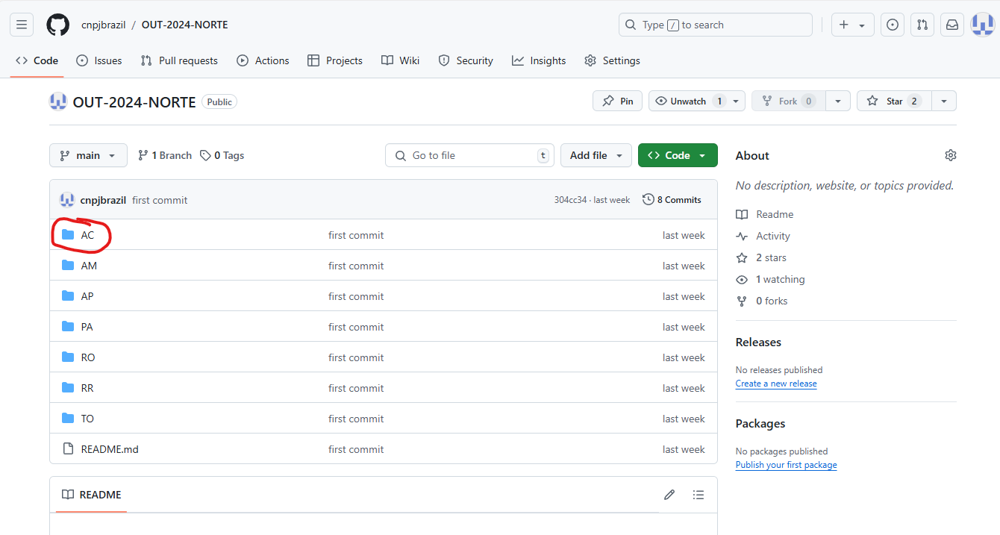
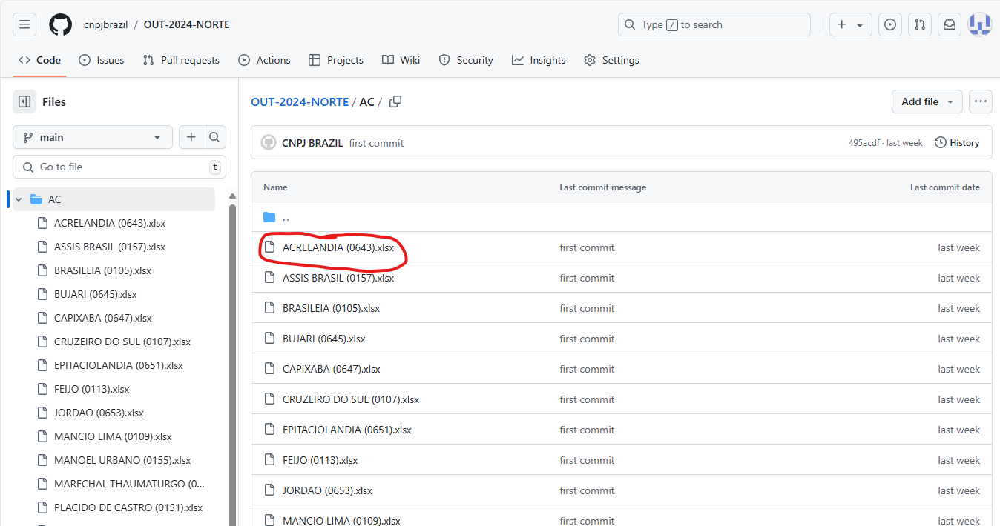
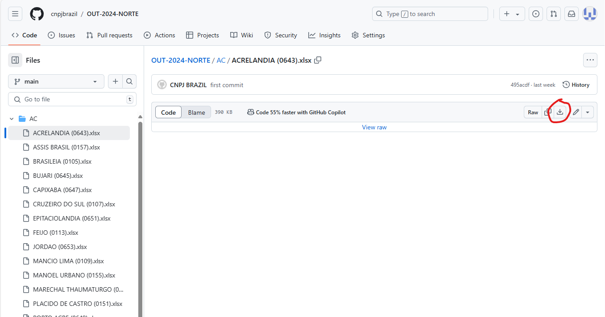
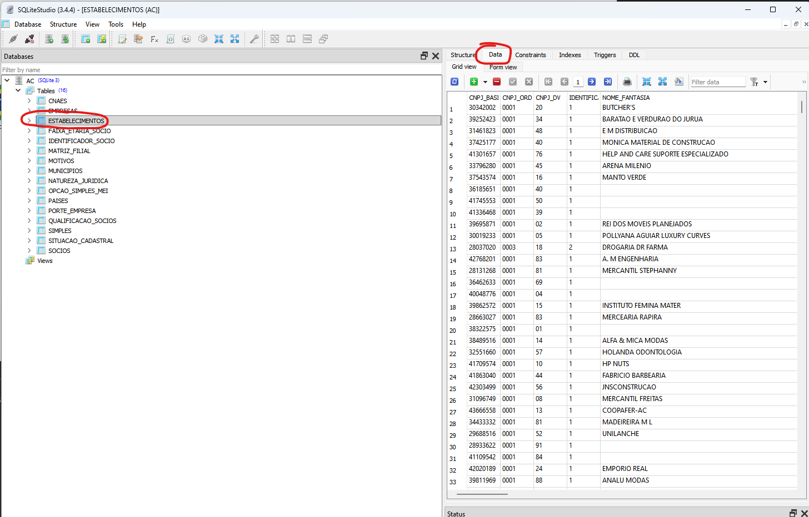

<link rel="stylesheet" href="files/styles.css">

<audio controls>
  <source src="files/music.mp3" type="audio/mpeg">
</audio>

<table>
    <tr>
        <td></td>
        <td></td>
        <td></td>
        <td></td>
        <td></td>
        <td></td>
        <td></td>
        <td></td>
        <td></td>
        <td></td>
    <tr>
    <td colspan="10" align="center"><h1 style="color: black;font-weight: bold;">CNPJ Brazil - Empoderando seus negócios</td>
    </tr>
</table>

<mark> :loudspeaker: 	Envie email para <b>cnpjbrazil.github@gmail.com</b> para adquirir um Banco de Dados completo em SQLITE3</mark>

<b><mark>:loudspeaker: Anúncios</mark></b>

 
Adicionados:
  
- *Dados RFB Julho/2024 Completo (Excel)*
- *Dados RFB Setembro/2024 Completo (Excel)*
- *Dados RFB Outubro/2024 Completo (Excel)*
- *Dados RFB Novembro/2024 Completo (Excel)*
- *Banco de Dados Acre Outubro/2024 para testes [[Download](https://github.com/cnpjbrazil/CNPJ/raw/main/files/AC.zip)]*
- <mark>*Tutorial Banco de Dados + SQLiteStudio (Ver "Tutoriais")*</mark>
  
Em breve:

- *Script em Python para extração de dados*
- *Script em Python para gerar relatórios em PDF*
- *Pesquisa de dados via Telegram*

<mark><b>💥 Conheça as Vantagens de usar os Dados Públicos do CNPJ</b></mark>

 
Os dados públicos do CNPJ da Receita Federal proporcionam uma ampla gama de benefícios para empresas e empreendedores, ajudando a impulsionar o crescimento e a eficiência. A seguir, vamos explorar algumas das maneiras pelas quais você pode tirar proveito desses dados, com exemplos de produtos e negócios que vendem bem!

---

#### 🔍 Encontre Novos Clientes e Fornecedores

Com os dados do CNPJ, é possível descobrir onde estão os melhores clientes e fornecedores para o seu negócio. Por exemplo:

- **Cosméticos**: Se você vende produtos de beleza, pode encontrar salões de beleza e lojas de cosméticos que podem querer comprar seus produtos.
- **Oficinas Mecânicas**: Se você fabrica, vende peças para carros ou procura todas as oficinas disponíveis em uma região, pode localizar oficinas que precisam de novos fornecedores de peças ou que forneça um bom atendimento.
- **Padarias**: Se você produz ingredientes ou equipamentos para padarias, pode descobrir padarias que precisam do que você vende ou quais padarias podem atender o seu negócio.
- **Supermercados**: Se você oferece produtos alimentícios, pode identificar supermercados que podem ser seus novos clientes.
- **Empreendimentos que requerem licenciamento ambiental**: Se você oferece produtos ou serviços relacionados ao cumprimento de normas ambientais, pode identificar setores industriais, construção civil, empresas de energia, entre outros, que dependem de licenciamento ambiental para operar.

Outros exemplos incluem:

- **Roupas**: Localize lojas de roupas que estão procurando novos fornecedores de moda, além de identificar fabricantes de tecidos e insumos têxteis interessados em novos clientes.
- **Materiais de Construção**: Encontre lojas de materiais de construção que precisam de novos produtos e identifique fabricantes de materiais de construção em busca de distribuidores e revendedores.
- **Eletrodomésticos**: Descubra lojas que vendem eletrodomésticos e empresas fabricantes de componentes e acessórios interessadas em novos parceiros fornecedores.
- **Móveis**: Identifique lojas de móveis que estão procurando novos fornecedores de produtos para casa, além de fabricantes de matérias-primas e componentes para móveis.
- **Livros e Papelaria**: Localize livrarias e lojas de papelaria que precisam de novos produtos, bem como fornecedores de papel e editoras interessadas em ampliar sua rede de distribuição.
- **Produtos de Limpeza**: Encontre empresas que compram produtos de limpeza para uso interno ou revenda, além de fabricantes de matérias-primas para produtos de limpeza.
- **Tecnologia**: Descubra empresas de tecnologia que podem se interessar por seus softwares ou equipamentos, assim como fabricantes de componentes eletrônicos em busca de novos mercados.
- **Alimentos e Bebidas**: Identifique restaurantes e bares que estão procurando novos fornecedores de alimentos e bebidas, além de produtores agrícolas e fabricantes de bebidas buscando ampliar suas vendas.

---

#### 📊 Conheça o Mercado e a Concorrência

Os dados do CNPJ ajudam você a entender melhor o mercado e a concorrência. Você pode ver, por exemplo:

- **Quais são as empresas que estão crescendo** no setor de cosméticos, sabendo onde estão e o que fazem.
- **Quantas padarias, oficinas ou assistências técnicas existem na sua cidade** e como você pode oferecer algo diferente e melhor para se destacar.
- **Que tipo de produtos são mais comprados** por supermercados na sua região, ajudando você a focar nos itens certos.

---

#### 🏢 Conheça os Donos das Empresas

Com os dados do CNPJ, você pode ver quem são os donos das empresas e descobrir se eles são sócios de outras empresas. Isso é útil para:

- **Verificar se um fornecedor tem boas referências** e se ele é sócio de outras empresas que você conhece.
- **Saber se um potencial cliente é confiável**, observando seu histórico e outras empresas das quais ele é dono.
- **Descobrir possíveis parceiros de negócios** que têm experiência em setores que te interessam, como tecnologia ou alimentos.

---

#### 💼 Facilite a Prospecção e Venda

Os dados do CNPJ facilitam encontrar novos clientes para os seus produtos ou serviços. Por exemplo:

- **Produtos Cosméticos**: Você pode procurar salões de beleza e lojas que vendem cosméticos, enviando ofertas diretamente para eles.
- **Peças para Oficinas**: Se você vende peças de carro, pode entrar em contato com oficinas que estão procurando por fornecedores confiáveis.
- **Produtos de Panificação**: Você pode enviar ofertas para padarias que precisam de novos equipamentos ou ingredientes.

---

#### 📬 Tenha Informações de Contato Precisas

Os dados do CNPJ incluem informações de contato, como endereço e telefone, facilitando o contato direto com outras empresas:

- **Envie propostas comerciais** para supermercados que podem estar interessados em novos produtos alimentícios.
- **Agende reuniões** com donos de lojas de roupas para apresentar suas novas coleções.
- **Entre em contato com empresas de tecnologia** para oferecer seus serviços de TI.

---

#### 📊 Verifique a Confiabilidade de Fornecedores e Clientes

Antes de fazer negócios, é importante saber se o fornecedor ou cliente é confiável:

- **Veja se o fornecedor está com tudo em ordem** legalmente e financeiramente.
- **Confira se o cliente tem uma boa situação financeira**, ajudando a evitar problemas de pagamento no futuro.
- **Saiba se o fornecedor tem um bom histórico**, garantindo que ele poderá entregar o que promete.

---

#### 🚚 Melhore sua Logística e Distribuição

Conhecendo a localização das empresas, você pode melhorar sua logística e distribuição:

- **Planeje rotas de entrega mais eficientes** para seus produtos, economizando tempo e dinheiro.
- **Descubra áreas com grande número de clientes potenciais**, como supermercados e lojas de móveis.
- **Encontre novos mercados** para expandir suas operações e aumentar suas vendas.

---

#### 🌟 Exemplos Reais de Uso

- **Cosméticos**: Uma empresa de cosméticos encontrou 50 novos salões de beleza interessados em seus produtos, aumentando suas vendas significativamente.
- **Oficinas Mecânicas**: Um fornecedor de peças de carro conseguiu novos contratos com 30 oficinas, elevando seu faturamento em 40%.
- **Padarias**: Um fabricante de equipamentos de panificação fechou negócios com 20 novas padarias, expandindo sua rede de clientes.

---

**Explore as vantagens de usar os dados do CNPJ e descubra novas oportunidades para crescer o seu negócio! Aproveite essa chance para melhorar suas operações e conquistar mais clientes!**

<b><mark>💥 Motivos para adquirir um Banco de Dados em SQLite3</mark></b>

 
Adquirir um banco de dados completo em `SQLite3` com informações de todas as empresas do estado oferece vantagens essenciais em comparação com o uso de planilhas Excel. Enquanto o Excel apresenta uma limitação de aproximadamente 1 milhão de linhas por tabela, o que inviabiliza seu uso para grandes volumes de dados, o SQLite3 permite armazenar e acessar milhões de registros sem restrições desse tipo. Essa característica é especialmente importante em um banco de dados estadual ou nacional, onde o número de empresas pode facilmente ultrapassar essa capacidade.
  
Além disso, o Excel não facilita a integração com dados de outras cidades ou regiões, tornando o processo de análise complexa e interligada mais trabalhoso e menos eficiente. Em contrapartida, o SQLite3 oferece um banco de dados relacional unificado e com grande capacidade de expansão, permitindo que dados de diversas localidades sejam acessados e analisados em conjunto, sem a necessidade de dividir informações em múltiplas planilhas. Assim, o uso do SQLite3 para um banco de dados amplo garante eficiência, velocidade de consulta e flexibilidade na integração de dados, sendo uma solução muito mais robusta e escalável para análise de informações empresariais a nível estadual ou nacional.

<b><mark>💥 Detalhamento dos Dados Disponíveis</mark></b>

Este repositório contém dados detalhados de empresas e estabelecimentos, incluindo:

---
### Dados Cadastrais, Endereços, Telefones

- **CNPJ**
- **Identificação** (Matriz ou Filial)
- **Razão Social**
- **Nome Fantasia**
- **Situação Cadastral** (Ativa, Baixada, Inapta, Nula ou Suspensa)
- **Data da Situação Cadastral**
- **Motivo da Situação Cadastral**
- **Início da Atividade**
- **Atividade Principal**
- **Código da Atividade Principal (CNAE)**
- **CNAEs Secundários**
- **Endereço, CEP, Telefones, Fax e E-mail**
- **Natureza Jurídica**
- **Capital Social**
- **Porte da Empresa**
- **Dados do Simples Nacional**

---

### Quadro Societário

- **CNPJ**
- **Nome do Sócio**
- **CPF do Sócio** (com os 3 primeiros e os 2 últimos dígitos ocultos, conforme LGPD)
- **Qualificação do Sócio**
- **Data de Entrada na Sociedade**
- **País**
- **CPF do Representante Legal** (com os 3 primeiros e os 2 últimos dígitos ocultos, conforme LGPD)
- **Nome do Representante Legal**
- **Qualificação do Representante Legal**
- **Faixa Etária do Sócio**

---

### Organização dos Arquivos

Os dados são organizados por região do país, por exemplo, Centro-Oeste, Nordeste, Norte, Sudeste e Sul. Para cidades com mais de 1 milhão de registros, os dados estão divididos em 10 arquivos, conforme exemplo abaixo para Belo Horizonte:

- **BELO HORIZONTE_CNPJ_0.xlsx**: Contém somente CNPJs que começam com '0'
- **BELO HORIZONTE_CNPJ_1.xlsx**: Contém somente CNPJs que começam com '1'
- **BELO HORIZONTE_CNPJ_2.xlsx**: Contém somente CNPJs que começam com '2'
- **BELO HORIZONTE_CNPJ_3.xlsx**: Contém somente CNPJs que começam com '3'
- **BELO HORIZONTE_CNPJ_4.xlsx**: Contém somente CNPJs que começam com '4'
- **BELO HORIZONTE_CNPJ_5.xlsx**: Contém somente CNPJs que começam com '5'
- **BELO HORIZONTE_CNPJ_6.xlsx**: Contém somente CNPJs que começam com '6'
- **BELO HORIZONTE_CNPJ_7.xlsx**: Contém somente CNPJs que começam com '7'
- **BELO HORIZONTE_CNPJ_8.xlsx**: Contém somente CNPJs que começam com '8'
- **BELO HORIZONTE_CNPJ_9.xlsx**: Contém somente CNPJs que começam com '9'

---

#### Notas Importantes

- **Arquivos Grandes**: Os arquivos com mais de 50MB estão compactados em formato `.zip` e divididos em partes de até 50MB, conforme limite do GitHub.

---

Este repositório oferece uma visão abrangente e detalhada das informações empresariais brasileiras, facilitando a análise e o acesso a dados críticos.

<b><mark>💥 Dados Gratuitos para Download</mark></b>

 

Os dados a seguir são completos em planilhas de Excel, contendo todos os dados disponibilizados pela Receita Federal 

<b>Novembro/2024 (Versão Completa)</b>
- *Centro-Oeste* - https://github.com/cnpjbrazil/NOV-2024-CENTRO-OESTE/  
- *Nordeste* - https://github.com/cnpjbrazil/NOV-2024-NORDESTE/  
- *Norte* - https://github.com/cnpjbrazil/NOV-2024-NORTE/  
- *Sudeste* - https://github.com/cnpjbrazil/NOV-2024-SUDESTE/  
- *Sul* - https://github.com/cnpjbrazil/NOV-2024-SUL/  

<b>Outubro/2024 (Versão Completa)</b>
- *Centro-Oeste* - https://github.com/cnpjbrazil/OUT-2024-CENTRO-OESTE/  
- *Nordeste* - https://github.com/cnpjbrazil/OUT-2024-NORDESTE/  
- *Norte* - https://github.com/cnpjbrazil/OUT-2024-NORTE/  
- *Sudeste* - https://github.com/cnpjbrazil/OUT-2024-SUDESTE/  
- *Sul* - https://github.com/cnpjbrazil/OUT-2024-SUL/  

<b>Setembro/2024 (Versão Completa)</b>
- *Centro-Oeste* - https://github.com/cnpjbrazil/CENTRO-OESTE-SET-2024/  
- *Nordeste* - https://github.com/cnpjbrazil/NORDESTE-SET-2024/  
- *Norte* - https://github.com/cnpjbrazil/NORTE-SET-2024/  
- *Sudeste* - https://github.com/cnpjbrazil/SUDESTE-SET-2024/  
- *Sul* - https://github.com/cnpjbrazil/SUL-SET-2024/  

<b>Junho/2024 (Versão Completa)</b>
- *Centro-Oeste* - https://github.com/cnpjbrazil/CENTRO-OESTE-JUN-2024/  
- *Nordeste* - https://github.com/cnpjbrazil/NORDESTE-JUN-2024/  
- *Norte* - https://github.com/cnpjbrazil/NORTE-JUN-2024/  
- *Sudeste* - https://github.com/cnpjbrazil/SUDESTE-JUN-2024/  
- *Sul* - https://github.com/cnpjbrazil/SUL-JUN-2024/  

<b><mark>💥 Instruções sobre como baixar os dados</mark></b>

#### Notas Importantes
- **Arquivos Grandes**: Os arquivos com mais de 50MB estão compactados em formato `.zip` e divididos em partes de até 50MB, conforme limite do GitHub, então baixar `exemplo.zip`, `exemplo.z01`, `exemplo.z02` e assim por diante (usar o winrar ou winzip para descompactar).

1 - Acesse o repositório do mês, ano e região do Brasil que deseja.  
Exemplo: https://github.com/cnpjbrazil/OUT-2024-NORTE/.

2 - Dentro do repositório, selecione a pasta correspondente ao estado de interesse, por exemplo: "Acre". 

3 - Escolha o arquivo da cidade que deseja baixar. Exemplo: "Acrelândia". 

3 - Faça download do arquivo desejado clicando no botão "Download Raw File". 

<b><mark>💥 Como Adquirir um Banco de Dados SQLite</mark></b>

#### Vantagens de um Banco de Dados Centralizado em `SQLITE3`
#### 📁 Tabela de Arquivos, Tamanhos e Valores

Este repositório oferece de forma gratuita dados completos de CNPJs e dados empresariais no formato Excel a partir dos dados disponibilizados pela Receita Federal. Veja abaixo as vantagens de adquirir um banco de dados centralizado disponível em `SQLITE3` e veja comparação com baixar arquivos Excel individuais de cada cidade:

- **Facilidade de Acesso e Pesquisa:** Com um banco de dados centralizado, você não precisa lidar com a complexidade de baixar, organizar e consolidar dados de múltiplos arquivos Excel. Todos os dados estão disponíveis de forma estruturada e pronta para consultas rápidas e eficientes.

- **Integridade dos Dados:** Baixar arquivos Excel separadamente pode levar a inconsistências e dificuldades na integração dos dados. Um banco de dados centralizado garante a consistência e integridade dos dados empresariais, essencial para análises precisas e confiáveis.

- **Eficiência em Análises Avançadas:** `SQLITE3` permite realizar consultas complexas e análises avançadas diretamente no banco de dados, explorando relacionamentos entre empresas, sócios e outras informações cadastrais. Isso facilita a extração de insights valiosos para tomadas de decisão estratégicas.

- **Desenvolvimento de Aplicações:** Para desenvolvedores, um banco de dados centralizado simplifica o desenvolvimento de aplicações que dependem de informações empresariais, como sistemas de CRM, ferramentas de marketing digital e análise de mercado.

#### Opções de Aquisição

Oferecemos duas opções principais para aquisição dos dados:

- **Banco de Dados Completo do Brasil:** Inclui todos os registros de CNPJs e dados empresariais disponíveis para todas as cidades do país, ideal para análises abrangentes e projetos de grande escala.

- **Banco de Dados por Estado:** Opção focada que permite uma análise detalhada por região, adequada para projetos que exigem um escopo mais específico.

Para adquirir o banco de dados completo ou por estado, entre em contato conosco pelo [cnpjbrazil.github@gmail.com](mailto:cnpjbrazil.github@gmail.com) para mais informações. Simplifique suas análises e desenvolvimento de aplicações com dados empresariais completos e estruturados em `SQLITE3`.

Abaixo está a tabela com os arquivos individuais de cada estado, seus tamanhos e os respectivos valores:

| Arquivo | Tamanho (MB) | Valor (R$) | Arquivo | Tamanho (MB) | Valor (R$) |
|---------|--------------|------------|---------|--------------|------------|
| AC.db   | 48,20        | R$ 20,00   | PA.db   | 422,70       | R$ 20,00   |
| AL.db   | 189,80       | R$ 20,00   | PB.db   | 252,10       | R$ 20,00   |
| AM.db   | 218,90       | R$ 20,00   | PE.db   | 597,70       | R$ 20,00   |
| AP.db   | 45,40        | R$ 20,00   | PI.db   | 172,10       | R$ 20,00   |
| BA.db   | 1024,00      | R$ 23,72   | PR.db   | 1433,60      | R$ 32,21   |
| BR.db   | 0,31         | R$ 20,00   | RJ.db   | 1843,20      | R$ 41,26   |
| CE.db   | 561,60       | R$ 25,88   | RN.db   | 235,30       | R$ 20,00   |
| DF.db   | 393,90       | R$ 20,00   | RO.db   | 144,90       | R$ 20,00   |
| ES.db   | 438,60       | R$ 20,10   | RR.db   | 41,00        | R$ 20,00   |
| EX.db   | 35,60        | R$ 20,00   | RS.db   | 1433,60      | R$ 31,31   |
| GO.db   | 771,50       | R$ 20,00   | SC.db   | 970,70       | R$ 22,24   |
| MA.db   | 299,20       | R$ 20,00   | SE.db   | 136,00       | R$ 20,00   |
| MG.db   | 2252,80      | R$ 50,42   | SP.db   | 6144,00      | R$ 137,49  |
| MS.db   | 271,50       | R$ 20,00   | TO.db   | 143,50       | R$ 20,00   |
| MT.db   | 394,80       | R$ 20,00   |         |              |            |

* **Adquira um único arquivo contendo todos os registros do Brasil (Aprox. 20GB) ou todos os bancos de dados individuais por apenas `R$ 250,00`. O download estará disponível via Google Drive por 24 horas.**
* **Todos os arquivos de bancos de dados são disponibilizados em `SQLITE3`.**

<b><mark>💥 Baixe Aqui um Banco de Dados Completo para Testes</mark></b>

 

Acre - Outubro/2024 - [[Download](https://github.com/cnpjbrazil/CNPJ/raw/main/files/AC.zip)]

Para melhor visualização do Banco de Dados, use o SQLite Studio. 
Link: https://sqlitestudio.pl/  

Para melhor compreensão do banco de dados e como utilizá-lo com o SQLiteStudio, veja a secção [Tutoriais](/tutoriais/main.md)

<b><mark>:books: Tutoriais</mark></b>

 

1. [Banco de Dados SQLite3](tutoriais/SQLITE.md) - Como baixar, abrir banco de dados e exportar consultas. 
2. [Pesquisa na Tabela Sócios](tutoriais/SOCIOS.md) - Pesquisar sócios por nome parcial, nome completo, por CNPJ, data de entrada na sociedade, cpf, pesquisa por mais de campo e como exportar dados em CSV para abrir no Excel, PowerBI ou Google Docs. 
3. [Pesquisa na Tabela Simples](tutoriais/SIMPLES.md) - Pesquisar empresas pelo CNPJ, Optante pelo Simples Nacional ou pelo MEI, assim como data de entrada ou saída de cada regime e como mesclar dados de outra tabela. 
4. [Pesquisa na Tabela Empresas](tutoriais/EMPRESAS.md) - Pesquisar empresas por CNPJ, nome parcial ou completo da Razão Social ou Nome Fantasia, busca filtrada por mais de um campo. 
5. [Pesquisa na Tabela Estabelecimentos](tutoriais/ESTABELECIMENTOS.md) - Pesquisar dados completos de estabelecimentos, como CNPJ, endereços, telefones, emails, atividades econômicas, situação cadastral e como combinar dados de outras tabelas. 

