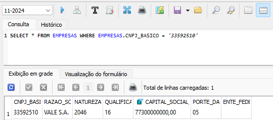
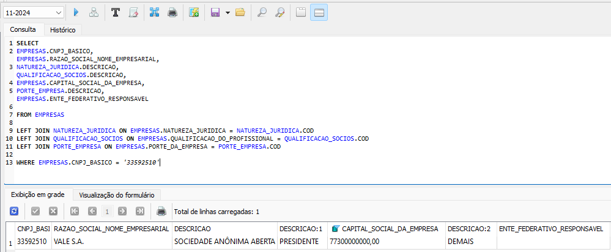
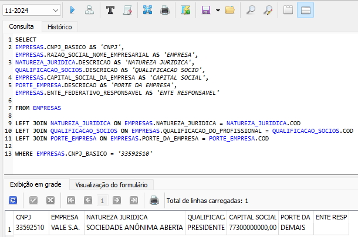
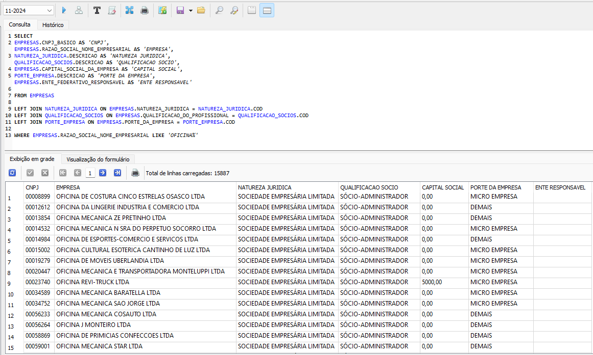
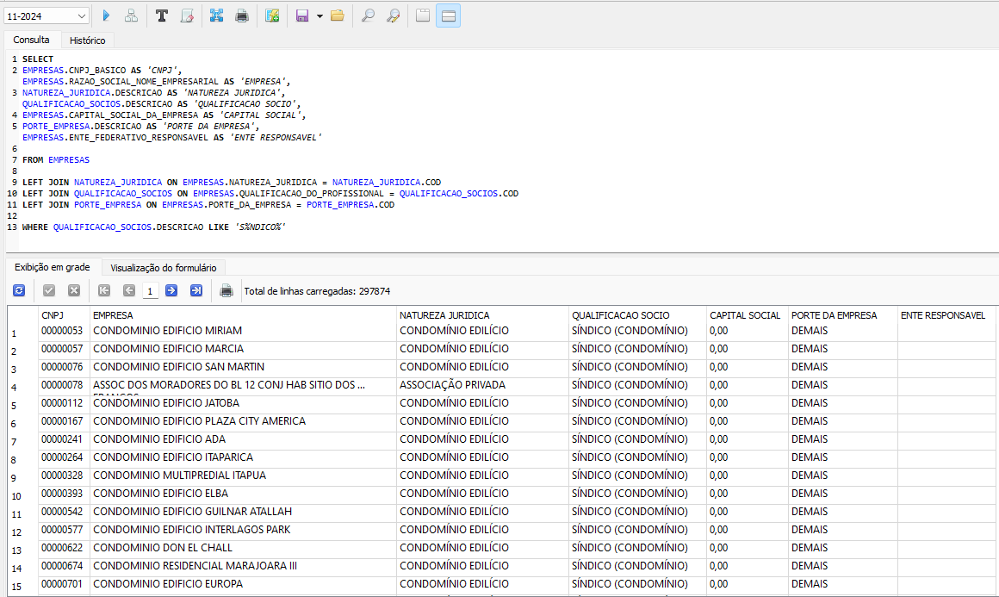
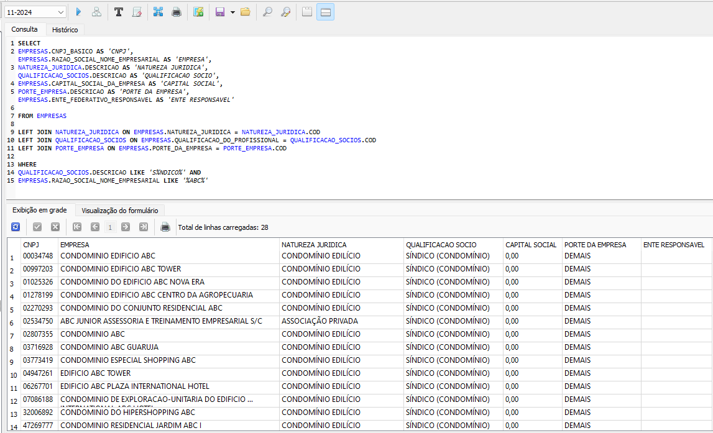

[VOLTAR AO INÍCIO](main.md)

# Como pesquisar empresas #

A tabela 'EMPRESAS' contém as informações sobre a empresa como CNPJ, razão social, natureza jurídica, capital social entre outras. Os campos da tabela são:

`CNPJ_BASICO` - CNPJ básico da empresa<BR>
`RAZAO_SOCIAL_NOME_EMPRESARIAL` - Razão Social ou Nome Empresarial<BR>
`NATUREZA_JURIDICA` - Natureza Jurídica da Empresa (ver códigos na tabela `NATUREZA_JURIDICA`)<BR>
`QUALIFICACAO_DO_PROFISSIONAL` - Qualificação / Profissão do Sócio (ver códigos na tabela `QUALIFICACAO_SOCIOS`)<BR>
`CAPITAL_SOCIAL_DA_EMPRESA` - Capital Social da Empresa<BR>
`PORTE_DA_EMPRESA` - Porte da Empresa (ver códigos na tabela `PORTE_EMPRESA`)<BR>
`ENTE_FEDERATIVO_RESPONSAVEL` - Ente federativo ao qual o estabelecimento é vinculado.<BR>


## Busca por CNPJ da Empresa ##

Você pode realizar busca exata de informações de empresas pelo CNPJ, como por exemplo da `VALE S.A.` com cnpj `33.592.510/0001-54`, onde:

`33.592.510`: CNPJ Básico - Identifica a raiz da empresa, comum a todas as filiais.<br>
`0001`: CNPJ Ordem - Representa a identificação de uma unidade específica (matriz ou filial).<br>
`54`: Dígitos Verificadores - Garantem a validade do número do CNPJ.<br>

Para buscar informações simples de um CNPJ_BASICO específico: 
```sql
SELECT * FROM EMPRESAS WHERE EMPRESAS.CNPJ_BASICO = '33592510'
```

ou

```sql
SELECT
EMPRESAS.CNPJ_BASICO,
EMPRESAS.RAZAO_SOCIAL_NOME_EMPRESARIAL,
EMPRESAS.NATUREZA_JURIDICA,
EMPRESAS.QUALIFICACAO_DO_PROFISSIONAL,
EMPRESAS.CAPITAL_SOCIAL_DA_EMPRESA,
EMPRESAS.PORTE_DA_EMPRESA,
EMPRESAS.ENTE_FEDERATIVO_RESPONSAVEL

FROM EMPRESAS
WHERE EMPRESAS.CNPJ_BASICO = '33592510'
```



Para buscas com todos os dados completos, pode utilizar o `LEFT JOIN` para unir dados de outras tabelas que guardam códigos como Natureza Jurídica, Qualificação do Profissional e Porte da Empresa.

```sql
SELECT
EMPRESAS.CNPJ_BASICO,
EMPRESAS.RAZAO_SOCIAL_NOME_EMPRESARIAL,
NATUREZA_JURIDICA.DESCRICAO,
QUALIFICACAO_SOCIOS.DESCRICAO,
EMPRESAS.CAPITAL_SOCIAL_DA_EMPRESA,
PORTE_EMPRESA.DESCRICAO,
EMPRESAS.ENTE_FEDERATIVO_RESPONSAVEL

FROM EMPRESAS

LEFT JOIN NATUREZA_JURIDICA ON EMPRESAS.NATUREZA_JURIDICA = NATUREZA_JURIDICA.COD
LEFT JOIN QUALIFICACAO_SOCIOS ON EMPRESAS.QUALIFICACAO_DO_PROFISSIONAL = QUALIFICACAO_SOCIOS.COD
LEFT JOIN PORTE_EMPRESA ON EMPRESAS.PORTE_DA_EMPRESA = PORTE_EMPRESA.COD

WHERE EMPRESAS.CNPJ_BASICO = '33592510'
```



Poderá renomear as colunas utilizando o `AS`.

```sql
SELECT
EMPRESAS.CNPJ_BASICO AS 'CNPJ',
EMPRESAS.RAZAO_SOCIAL_NOME_EMPRESARIAL AS 'EMPRESA',
NATUREZA_JURIDICA.DESCRICAO AS 'NATUREZA JURIDICA',
QUALIFICACAO_SOCIOS.DESCRICAO AS 'QUALIFICACAO SOCIO',
EMPRESAS.CAPITAL_SOCIAL_DA_EMPRESA AS 'CAPITAL SOCIAL',
PORTE_EMPRESA.DESCRICAO AS 'PORTE DA EMPRESA',
EMPRESAS.ENTE_FEDERATIVO_RESPONSAVEL AS 'ENTE RESPONSAVEL'

FROM EMPRESAS

LEFT JOIN NATUREZA_JURIDICA ON EMPRESAS.NATUREZA_JURIDICA = NATUREZA_JURIDICA.COD
LEFT JOIN QUALIFICACAO_SOCIOS ON EMPRESAS.QUALIFICACAO_DO_PROFISSIONAL = QUALIFICACAO_SOCIOS.COD
LEFT JOIN PORTE_EMPRESA ON EMPRESAS.PORTE_DA_EMPRESA = PORTE_EMPRESA.COD

WHERE EMPRESAS.CNPJ_BASICO = '33592510'
```




## Busca por nome parcial ou nome completo ##

Você pode buscar todas as empresas cuja Razão Social começa por `OFICINA`.

```sql
SELECT
EMPRESAS.CNPJ_BASICO AS 'CNPJ',
EMPRESAS.RAZAO_SOCIAL_NOME_EMPRESARIAL AS 'EMPRESA',
NATUREZA_JURIDICA.DESCRICAO AS 'NATUREZA JURIDICA',
QUALIFICACAO_SOCIOS.DESCRICAO AS 'QUALIFICACAO SOCIO',
EMPRESAS.CAPITAL_SOCIAL_DA_EMPRESA AS 'CAPITAL SOCIAL',
PORTE_EMPRESA.DESCRICAO AS 'PORTE DA EMPRESA',
EMPRESAS.ENTE_FEDERATIVO_RESPONSAVEL AS 'ENTE RESPONSAVEL'

FROM EMPRESAS

LEFT JOIN NATUREZA_JURIDICA ON EMPRESAS.NATUREZA_JURIDICA = NATUREZA_JURIDICA.COD
LEFT JOIN QUALIFICACAO_SOCIOS ON EMPRESAS.QUALIFICACAO_DO_PROFISSIONAL = QUALIFICACAO_SOCIOS.COD
LEFT JOIN PORTE_EMPRESA ON EMPRESAS.PORTE_DA_EMPRESA = PORTE_EMPRESA.COD

WHERE EMPRESAS.RAZAO_SOCIAL_NOME_EMPRESARIAL LIKE 'OFICINA%'
```




Você pode buscar todas as empresas cujo responsável seja um síndico.

```sql
SELECT
EMPRESAS.CNPJ_BASICO AS 'CNPJ',
EMPRESAS.RAZAO_SOCIAL_NOME_EMPRESARIAL AS 'EMPRESA',
NATUREZA_JURIDICA.DESCRICAO AS 'NATUREZA JURIDICA',
QUALIFICACAO_SOCIOS.DESCRICAO AS 'QUALIFICACAO SOCIO',
EMPRESAS.CAPITAL_SOCIAL_DA_EMPRESA AS 'CAPITAL SOCIAL',
PORTE_EMPRESA.DESCRICAO AS 'PORTE DA EMPRESA',
EMPRESAS.ENTE_FEDERATIVO_RESPONSAVEL AS 'ENTE RESPONSAVEL'

FROM EMPRESAS

LEFT JOIN NATUREZA_JURIDICA ON EMPRESAS.NATUREZA_JURIDICA = NATUREZA_JURIDICA.COD
LEFT JOIN QUALIFICACAO_SOCIOS ON EMPRESAS.QUALIFICACAO_DO_PROFISSIONAL = QUALIFICACAO_SOCIOS.COD
LEFT JOIN PORTE_EMPRESA ON EMPRESAS.PORTE_DA_EMPRESA = PORTE_EMPRESA.COD

WHERE QUALIFICACAO_SOCIOS.DESCRICAO LIKE 'S%NDICO%'
```



## Busca de empresa por mais de um campo de pesquisa ##

Você pode buscar todas as empresas cujo responsável seja um síndico e cuja razão social contenha a palavra `ABC`.

```sql
SELECT
EMPRESAS.CNPJ_BASICO AS 'CNPJ',
EMPRESAS.RAZAO_SOCIAL_NOME_EMPRESARIAL AS 'EMPRESA',
NATUREZA_JURIDICA.DESCRICAO AS 'NATUREZA JURIDICA',
QUALIFICACAO_SOCIOS.DESCRICAO AS 'QUALIFICACAO SOCIO',
EMPRESAS.CAPITAL_SOCIAL_DA_EMPRESA AS 'CAPITAL SOCIAL',
PORTE_EMPRESA.DESCRICAO AS 'PORTE DA EMPRESA',
EMPRESAS.ENTE_FEDERATIVO_RESPONSAVEL AS 'ENTE RESPONSAVEL'

FROM EMPRESAS

LEFT JOIN NATUREZA_JURIDICA ON EMPRESAS.NATUREZA_JURIDICA = NATUREZA_JURIDICA.COD
LEFT JOIN QUALIFICACAO_SOCIOS ON EMPRESAS.QUALIFICACAO_DO_PROFISSIONAL = QUALIFICACAO_SOCIOS.COD
LEFT JOIN PORTE_EMPRESA ON EMPRESAS.PORTE_DA_EMPRESA = PORTE_EMPRESA.COD

WHERE
QUALIFICACAO_SOCIOS.DESCRICAO LIKE 'S%NDICO%' AND
EMPRESAS.RAZAO_SOCIAL_NOME_EMPRESARIAL LIKE '%ABC%'
```



[VOLTAR AO INÍCIO](main.md)
