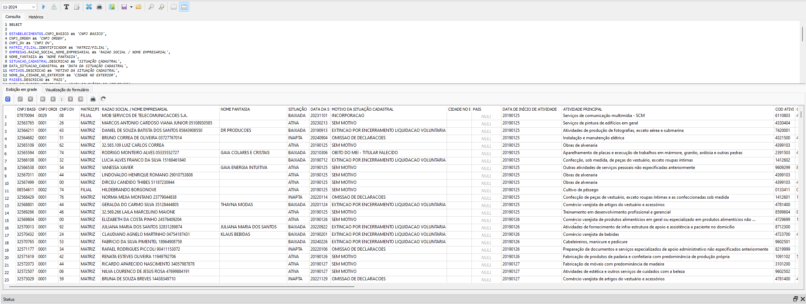
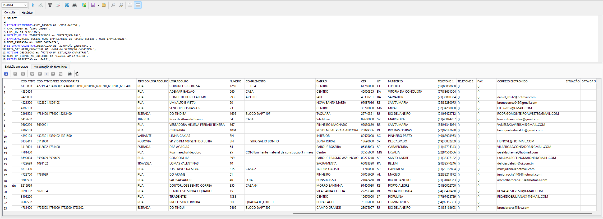
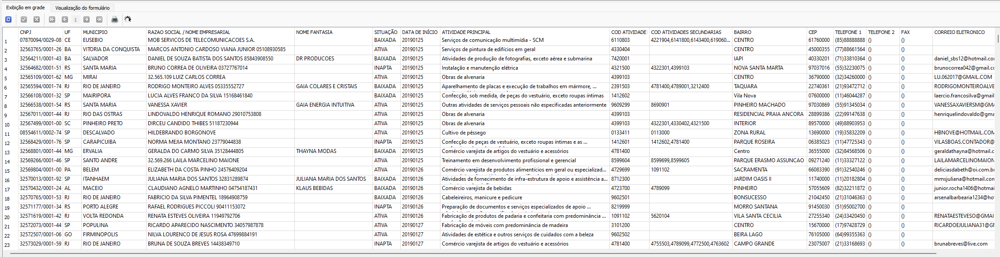
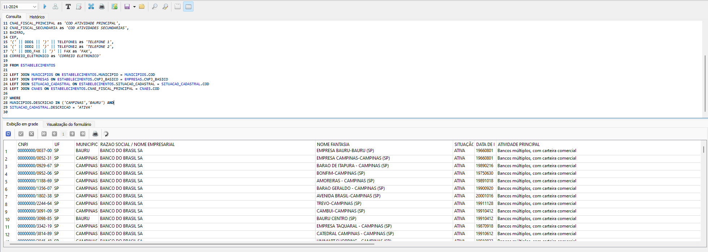

[VOLTAR AO INÍCIO](main.md)

# Como pesquisar estabelecimentos #

A tabela 'EMPRESAS' contém as informações sobre a empresa como CNPJ, razão social, natureza jurídica, capital social entre outras. Os campos da tabela são:

`CNPJ_BASICO`: Parte inicial do CNPJ, composta por 8 dígitos, que identifica a empresa matriz e todas as suas filiais.<BR>
`CNPJ_ORDEM`: Sequência de 4 dígitos que, combinada ao CNPJ_BASICO, identifica exclusivamente a matriz ou uma filial da empresa.<BR>
`CNPJ_DV`: Dígitos verificadores (2 dígitos finais do CNPJ) usados para validar a autenticidade do CNPJ.<BR>
`IDENTIFICADOR_MATRIZ_FILIAL`: Código que identifica se o registro é referente à matriz ou a uma filial da empresa (ver códigos na tabela `MATRIZ_FILIAL`).<BR>
`NOME_FANTASIA`: Nome comercial ou de marca utilizado pela empresa, geralmente diferente da razão social.<BR>
`SITUACAO_CADASTRAL`: Código que indica o status atual do registro da empresa na Receita Federal (ver códigos na tabela `SITUACAO_CADASTRAL`).<BR>
`DATA_SITUACAO_CADASTRAL`: Data da última atualização ou alteração no status cadastral da empresa.<BR>
`MOTIVO_SITUACAO_CADASTRAL`: Código que detalha o motivo de uma mudança na situação cadastral da empresa (ver códigos na tabela `MOTIVOS`).<BR>
`NOME_DA_CIDADE_NO_EXTERIOR`: Nome da cidade no exterior onde a empresa está localizada, caso tenha endereço fora do Brasil.<BR>
`PAIS`: Código do país onde a empresa está localizada, se for estrangeira (ver códigos na tabela `PAISES`).<BR>
`DATA_DE_INICIO_ATIVIDADE`: Data oficial de início das operações da empresa.<BR>
`CNAE_FISCAL_PRINCIPAL`: Código da Classificação Nacional de Atividades Econômicas (CNAE) que descreve a atividade principal da empresa (ver códigos na tabela `CNAES`).<BR>
`CNAE_FISCAL_SECUNDARIA`: Lista de códigos CNAE que descrevem as atividades secundárias da empresa, separadas por vírgulas, se houver (ver códigos na tabela `CNAES`).<BR>
`TIPO_LOGRADOURO`: Tipo do endereço da empresa (ex.: Rua, Avenida, Travessa).<BR>
`LOGRADOURO`: Nome do logradouro onde a empresa está localizada.<BR>
`NUMERO`: Número do imóvel no endereço da empresa.<BR>
`COMPLEMENTO`: Informações adicionais sobre o endereço, como sala, bloco ou apartamento.<BR>
`BAIRRO`: Nome do bairro onde a empresa está localizada.<BR>
`CEP`: Código de Endereçamento Postal do endereço da empresa.<BR>
`MUNICIPIO`: Código do município onde a empresa está localizada (ver códigos na tabela `MUNICIPIOS`).<BR>
`DDD1`: Código de Discagem Direta à Distância (DDD) do telefone principal da empresa.<BR>
`TELEFONE1`: Número do telefone principal da empresa.<BR>
`DDD2`: Código de Discagem Direta à Distância (DDD) do telefone secundário da empresa, se houver.<BR>
`TELEFONE2`: Número do telefone secundário da empresa, se houver.<BR>
`DDD_FAX`: Código de Discagem Direta à Distância (DDD) do fax da empresa, se houver.<BR>
`FAX`: Número do fax da empresa, se houver.<BR>
`CORREIO_ELETRONICO`: Endereço de e-mail da empresa, se fornecido.<BR>
`SITUACAO_ESPECIAL`: Status adicional que pode ser atribuído à empresa em situações específicas (ex.: recuperação judicial, falência). (ver códigos na tabela `MOTIVOS`).<BR>
`DATA_SITUACAO_ESPECIAL`: Data em que foi registrada uma situação especial para a empresa.<BR>


## Pesquisa com dados completos sobre todas os estabelecimentos ##

Você pode pesquisar e integrar todas as tabelas em uma única visualização, com o comando a seguir.

```sql
SELECT

ESTABELECIMENTOS.CNPJ_BASICO as 'CNPJ BASICO',
CNPJ_ORDEM as 'CNPJ ORDEM',
CNPJ_DV as 'CNPJ DV',
MATRIZ_FILIAL.IDENTIFICADOR as 'MATRIZ/FILIAL',
EMPRESAS.RAZAO_SOCIAL_NOME_EMPRESARIAL as 'RAZAO SOCIAL / NOME EMPRESARIAL',
NOME_FANTASIA as 'NOME FANTASIA',
SITUACAO_CADASTRAL.DESCRICAO as 'SITUAÇÃO CADASTRAL',
DATA_SITUACAO_CADASTRAL as 'DATA DA SITUAÇÃO CADASTRAL',
MOTIVOS.DESCRICAO as 'MOTIVO DA SITUAÇÃO CADASTRAL',
NOME_DA_CIDADE_NO_EXTERIOR as 'CIDADE NO EXTERIOR',
PAISES.DESCRICAO as 'PAIS',
DATA_DE_INICIO_ATIVIDADE as 'DATA DE INÍCIO DE ATIVIDADE',
CNAES.DESCRICAO as 'ATIVIDADE PRINCIPAL',
CNAE_FISCAL_PRINCIPAL as 'COD ATIVIDADE PRINCIPAL',
CNAE_FISCAL_SECUNDARIA as 'COD ATIVIDADES SECUNDARIAS',
TIPO_LOGRADOURO as 'TIPO DO LOGRADOURO',
LOGRADOURO,
NUMERO,
COMPLEMENTO,
BAIRRO,
CEP,
UF,
MUNICIPIOS.DESCRICAO as 'MUNICIPIO',
'(' || DDD1 || ')' || TELEFONE1 as 'TELEFONE 1',
'(' || DDD2 || ')' || TELEFONE2 as 'TELEFONE 2',
'(' || DDD_FAX || ')' || FAX as 'FAX',
CORREIO_ELETRONICO as 'CORREIO ELETRONICO',
SITUACAO_ESPECIAL as 'SITUAÇÃO ESPECIAL',
DATA_SITUACAO_ESPECIAL as 'DATA DA SITUAÇÃO ESPECIAL'

FROM ESTABELECIMENTOS

LEFT JOIN MUNICIPIOS ON ESTABELECIMENTOS.MUNICIPIO = MUNICIPIOS.COD
LEFT JOIN MATRIZ_FILIAL ON ESTABELECIMENTOS.IDENTIFICADOR_MATRIZ_FILIAL = MATRIZ_FILIAL.COD
LEFT JOIN EMPRESAS ON ESTABELECIMENTOS.CNPJ_BASICO = EMPRESAS.CNPJ_BASICO
LEFT JOIN SITUACAO_CADASTRAL ON ESTABELECIMENTOS.SITUACAO_CADASTRAL = SITUACAO_CADASTRAL.COD
LEFT JOIN MOTIVOS ON ESTABELECIMENTOS.MOTIVO_SITUACAO_CADASTRAL = MOTIVOS.COD
LEFT JOIN PAISES ON ESTABELECIMENTOS.PAIS = PAISES.COD
LEFT JOIN CNAES ON ESTABELECIMENTOS.CNAE_FISCAL_PRINCIPAL = CNAES.COD
```





Ou você pode pegar somente os dados essenciais como nomes, endereço, telefones, email, CNAE...

```sql
SELECT

ESTABELECIMENTOS.CNPJ_BASICO || '/' || CNPJ_ORDEM || '-' ||CNPJ_DV as 'CNPJ',
UF,
MUNICIPIOS.DESCRICAO as 'MUNICIPIO',
EMPRESAS.RAZAO_SOCIAL_NOME_EMPRESARIAL as 'RAZAO SOCIAL / NOME EMPRESARIAL',
NOME_FANTASIA as 'NOME FANTASIA',
SITUACAO_CADASTRAL.DESCRICAO as 'SITUAÇÃO CADASTRAL',
DATA_DE_INICIO_ATIVIDADE as 'DATA DE INÍCIO DE ATIVIDADE',
CNAES.DESCRICAO as 'ATIVIDADE PRINCIPAL',
CNAE_FISCAL_PRINCIPAL as 'COD ATIVIDADE PRINCIPAL',
CNAE_FISCAL_SECUNDARIA as 'COD ATIVIDADES SECUNDARIAS',
BAIRRO,
CEP,
'(' || DDD1 || ')' || TELEFONE1 as 'TELEFONE 1',
'(' || DDD2 || ')' || TELEFONE2 as 'TELEFONE 2',
'(' || DDD_FAX || ')' || FAX as 'FAX',
CORREIO_ELETRONICO as 'CORREIO ELETRONICO'

FROM ESTABELECIMENTOS

LEFT JOIN MUNICIPIOS ON ESTABELECIMENTOS.MUNICIPIO = MUNICIPIOS.COD
LEFT JOIN EMPRESAS ON ESTABELECIMENTOS.CNPJ_BASICO = EMPRESAS.CNPJ_BASICO
LEFT JOIN SITUACAO_CADASTRAL ON ESTABELECIMENTOS.SITUACAO_CADASTRAL = SITUACAO_CADASTRAL.COD
LEFT JOIN CNAES ON ESTABELECIMENTOS.CNAE_FISCAL_PRINCIPAL = CNAES.COD
```



O exemplo a seguir mostrar como filtrar dados para as cidades `BAURU` e `CAMPINAS` cuja situação cadastral é `ATIVA`. Isso pode demorar muito tempo... (~30 min)

```sql
SELECT

ESTABELECIMENTOS.CNPJ_BASICO || '/' || CNPJ_ORDEM || '-' ||CNPJ_DV as 'CNPJ',
UF,
MUNICIPIOS.DESCRICAO as 'MUNICIPIO',
EMPRESAS.RAZAO_SOCIAL_NOME_EMPRESARIAL as 'RAZAO SOCIAL / NOME EMPRESARIAL',
NOME_FANTASIA as 'NOME FANTASIA',
SITUACAO_CADASTRAL.DESCRICAO as 'SITUAÇÃO CADASTRAL',
DATA_DE_INICIO_ATIVIDADE as 'DATA DE INÍCIO DE ATIVIDADE',
CNAES.DESCRICAO as 'ATIVIDADE PRINCIPAL',
CNAE_FISCAL_PRINCIPAL as 'COD ATIVIDADE PRINCIPAL',
CNAE_FISCAL_SECUNDARIA as 'COD ATIVIDADES SECUNDARIAS',
BAIRRO,
CEP,
'(' || DDD1 || ')' || TELEFONE1 as 'TELEFONE 1',
'(' || DDD2 || ')' || TELEFONE2 as 'TELEFONE 2',
'(' || DDD_FAX || ')' || FAX as 'FAX',
CORREIO_ELETRONICO as 'CORREIO ELETRONICO'

FROM ESTABELECIMENTOS

LEFT JOIN MUNICIPIOS ON ESTABELECIMENTOS.MUNICIPIO = MUNICIPIOS.COD
LEFT JOIN EMPRESAS ON ESTABELECIMENTOS.CNPJ_BASICO = EMPRESAS.CNPJ_BASICO
LEFT JOIN SITUACAO_CADASTRAL ON ESTABELECIMENTOS.SITUACAO_CADASTRAL = SITUACAO_CADASTRAL.COD
LEFT JOIN CNAES ON ESTABELECIMENTOS.CNAE_FISCAL_PRINCIPAL = CNAES.COD

WHERE
MUNICIPIOS.DESCRICAO IN ('CAMPINAS','BAURU') AND
SITUACAO_CADASTRAL.DESCRICAO = 'ATIVA'
```

