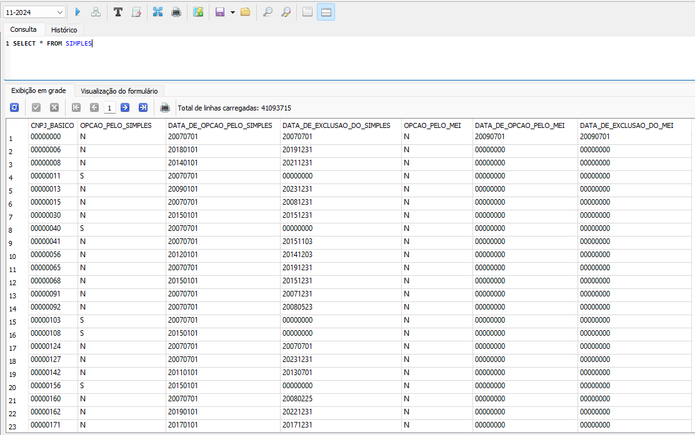
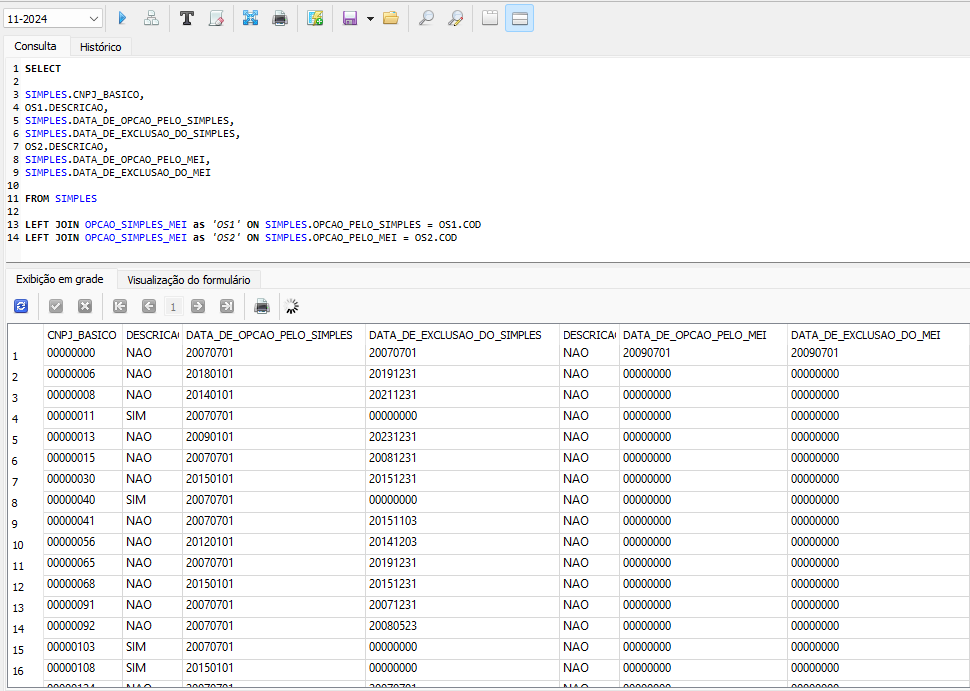
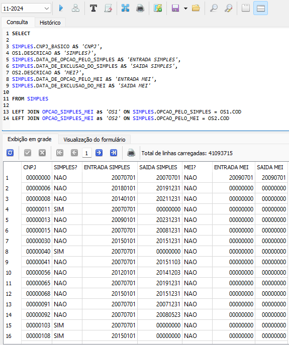
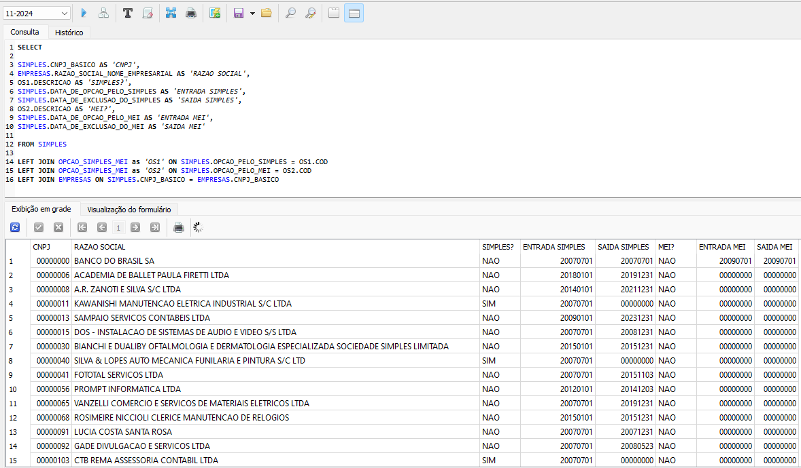
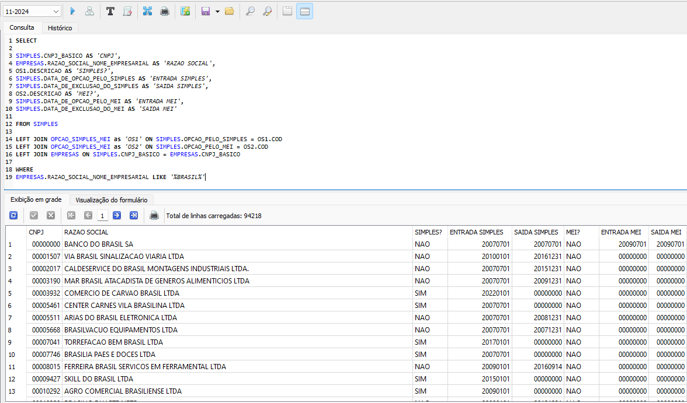
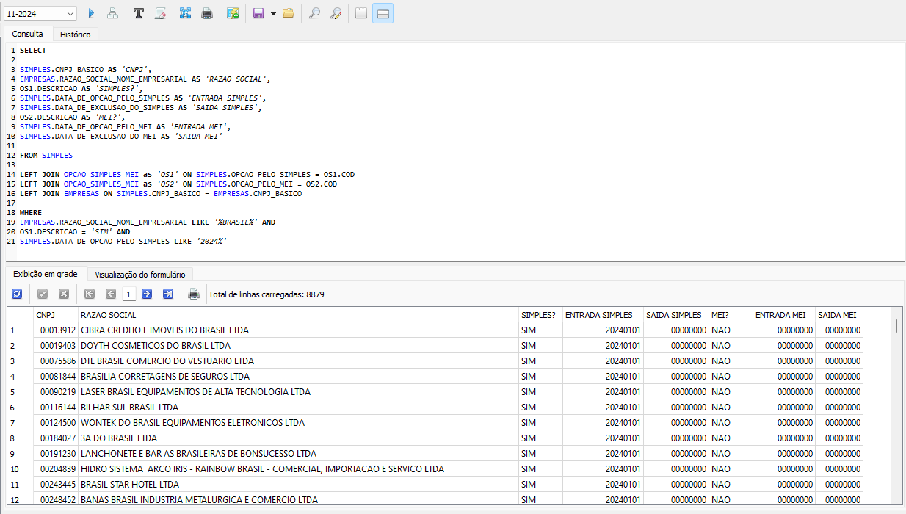

[VOLTAR AO INÍCIO](main.md)

# Como pesquisar empresas pelo Simples #

A tabela `SIMPLES` contém informações relacionadas à adesão e exclusão de empresas aos regimes tributários Simples Nacional e MEI (Microempreendedor Individual). Essas informações ajudam a identificar o enquadramento tributário da empresa e as respectivas datas de alteração no regime.

`CNPJ_BASICO` - CNPJ básico da empresa<BR>
`OPCAO_PELO_SIMPLES`: Indica se a empresa optou pelo regime tributário Simples Nacional. Valores comuns: S (Sim) ou N (Não).<BR>
`DATA_DE_OPCAO_PELO_SIMPLES`: Data em que a empresa aderiu ao regime do Simples Nacional, caso aplicável.<BR>
`DATA_DE_EXCLUSAO_DO_SIMPLES`: Data em que a empresa foi excluída do regime do Simples Nacional, caso aplicável.<BR>
`OPCAO_PELO_MEI`: Indica se a empresa é registrada como Microempreendedor Individual (MEI). Valores comuns: S (Sim) ou N (Não).<BR>
`DATA_DE_OPCAO_PELO_MEI`: Data em que a empresa aderiu ao regime MEI, caso aplicável.<BR>
`DATA_DE_EXCLUSAO_DO_MEI`: Data em que a empresa deixou de estar registrada no regime MEI, caso aplicável.<BR>


## Busca por CNPJ da Empresa ##

Você pode realizar busca exata de informações de empresas pelo CNPJ ou buscar informações simples de todas as empresas:

```sql
SELECT * FROM SIMPLES
```

ou

```sql
SELECT
SIMPLES.CNPJ_BASICO,
SIMPLES.OPCAO_PELO_SIMPLES,
SIMPLES.DATA_DE_OPCAO_PELO_SIMPLES,
SIMPLES.DATA_DE_EXCLUSAO_DO_SIMPLES,
SIMPLES.OPCAO_PELO_MEI,
SIMPLES.DATA_DE_OPCAO_PELO_MEI,
SIMPLES.DATA_DE_EXCLUSAO_DO_MEI
FROM SIMPLES
```



Para buscas com todos os dados completos, pode utilizar o `LEFT JOIN` para unir dados de outras tabelas que guardam códigos.

```sql
SELECT

SIMPLES.CNPJ_BASICO,
OS1.DESCRICAO,
SIMPLES.DATA_DE_OPCAO_PELO_SIMPLES,
SIMPLES.DATA_DE_EXCLUSAO_DO_SIMPLES,
OS2.DESCRICAO,
SIMPLES.DATA_DE_OPCAO_PELO_MEI,
SIMPLES.DATA_DE_EXCLUSAO_DO_MEI

FROM SIMPLES

LEFT JOIN OPCAO_SIMPLES_MEI as 'OS1' ON SIMPLES.OPCAO_PELO_SIMPLES = OS1.COD
LEFT JOIN OPCAO_SIMPLES_MEI as 'OS2' ON SIMPLES.OPCAO_PELO_MEI = OS2.COD
```



Poderá renomear as colunas utilizando o `AS`.

```sql
SELECT

SIMPLES.CNPJ_BASICO AS 'CNPJ',
OS1.DESCRICAO AS 'SIMPLES?',
SIMPLES.DATA_DE_OPCAO_PELO_SIMPLES AS 'ENTRADA SIMPLES',
SIMPLES.DATA_DE_EXCLUSAO_DO_SIMPLES AS 'SAIDA SIMPLES',
OS2.DESCRICAO AS 'MEI?',
SIMPLES.DATA_DE_OPCAO_PELO_MEI AS 'ENTRADA MEI',
SIMPLES.DATA_DE_EXCLUSAO_DO_MEI AS 'SAIDA MEI'

FROM SIMPLES

LEFT JOIN OPCAO_SIMPLES_MEI as 'OS1' ON SIMPLES.OPCAO_PELO_SIMPLES = OS1.COD
LEFT JOIN OPCAO_SIMPLES_MEI as 'OS2' ON SIMPLES.OPCAO_PELO_MEI = OS2.COD
```




## Inserindo mais dados na consulta ##

Você pode inserir mais dados na consulta como por exemplo o nome da empresa.

```sql
SELECT

SIMPLES.CNPJ_BASICO AS 'CNPJ',
EMPRESAS.RAZAO_SOCIAL_NOME_EMPRESARIAL AS 'RAZAO SOCIAL',
OS1.DESCRICAO AS 'SIMPLES?',
SIMPLES.DATA_DE_OPCAO_PELO_SIMPLES AS 'ENTRADA SIMPLES',
SIMPLES.DATA_DE_EXCLUSAO_DO_SIMPLES AS 'SAIDA SIMPLES',
OS2.DESCRICAO AS 'MEI?',
SIMPLES.DATA_DE_OPCAO_PELO_MEI AS 'ENTRADA MEI',
SIMPLES.DATA_DE_EXCLUSAO_DO_MEI AS 'SAIDA MEI'

FROM SIMPLES

LEFT JOIN OPCAO_SIMPLES_MEI as 'OS1' ON SIMPLES.OPCAO_PELO_SIMPLES = OS1.COD
LEFT JOIN OPCAO_SIMPLES_MEI as 'OS2' ON SIMPLES.OPCAO_PELO_MEI = OS2.COD
LEFT JOIN EMPRESAS ON SIMPLES.CNPJ_BASICO = EMPRESAS.CNPJ_BASICO
```




Você pode buscar dados do SIMPLES todas as empresas que contenham `BRASIL` na Razão Social.

```sql
SELECT

SIMPLES.CNPJ_BASICO AS 'CNPJ',
EMPRESAS.RAZAO_SOCIAL_NOME_EMPRESARIAL AS 'RAZAO SOCIAL',
OS1.DESCRICAO AS 'SIMPLES?',
SIMPLES.DATA_DE_OPCAO_PELO_SIMPLES AS 'ENTRADA SIMPLES',
SIMPLES.DATA_DE_EXCLUSAO_DO_SIMPLES AS 'SAIDA SIMPLES',
OS2.DESCRICAO AS 'MEI?',
SIMPLES.DATA_DE_OPCAO_PELO_MEI AS 'ENTRADA MEI',
SIMPLES.DATA_DE_EXCLUSAO_DO_MEI AS 'SAIDA MEI'

FROM SIMPLES

LEFT JOIN OPCAO_SIMPLES_MEI as 'OS1' ON SIMPLES.OPCAO_PELO_SIMPLES = OS1.COD
LEFT JOIN OPCAO_SIMPLES_MEI as 'OS2' ON SIMPLES.OPCAO_PELO_MEI = OS2.COD
LEFT JOIN EMPRESAS ON SIMPLES.CNPJ_BASICO = EMPRESAS.CNPJ_BASICO

WHERE
EMPRESAS.RAZAO_SOCIAL_NOME_EMPRESARIAL LIKE '%BRASIL%'
```



## Busca de empresa por mais de um campo de pesquisa ##

Você pode buscar dados do SIMPLES todas as empresas que contenham `BRASIL` na Razão Social e que são Optante pelo SIMPLES desde Janeiro/2024.

```sql
SELECT

SIMPLES.CNPJ_BASICO AS 'CNPJ',
EMPRESAS.RAZAO_SOCIAL_NOME_EMPRESARIAL AS 'RAZAO SOCIAL',
OS1.DESCRICAO AS 'SIMPLES?',
SIMPLES.DATA_DE_OPCAO_PELO_SIMPLES AS 'ENTRADA SIMPLES',
SIMPLES.DATA_DE_EXCLUSAO_DO_SIMPLES AS 'SAIDA SIMPLES',
OS2.DESCRICAO AS 'MEI?',
SIMPLES.DATA_DE_OPCAO_PELO_MEI AS 'ENTRADA MEI',
SIMPLES.DATA_DE_EXCLUSAO_DO_MEI AS 'SAIDA MEI'

FROM SIMPLES

LEFT JOIN OPCAO_SIMPLES_MEI as 'OS1' ON SIMPLES.OPCAO_PELO_SIMPLES = OS1.COD
LEFT JOIN OPCAO_SIMPLES_MEI as 'OS2' ON SIMPLES.OPCAO_PELO_MEI = OS2.COD
LEFT JOIN EMPRESAS ON SIMPLES.CNPJ_BASICO = EMPRESAS.CNPJ_BASICO

WHERE
EMPRESAS.RAZAO_SOCIAL_NOME_EMPRESARIAL LIKE '%BRASIL%' AND
OS1.DESCRICAO = 'SIM' AND
SIMPLES.DATA_DE_OPCAO_PELO_SIMPLES LIKE '2024%'
```

