[VOLTAR AO INÍCIO](main.md)

# Como pesquisar sócios #

A tabela 'SOCIOS' contém as informações sobre o quadro proprietário de cada empresa assim como informação sobre o sócio, como idade, profissão, representante legal, data de entrada na sociedade e etc. Os campos da tabela são:

`CNPJ_BASICO` - CNPJ básico da empresa <BR>
`IDENTIFICADOR_DE_SOCIO` - Idenficador se o Sócio é CPF ou CNPJ <BR>
`NOME_DO_SOCIO` - Nome do Sócio <BR>
`CNPJ_CPF_SOCIO` - CNPJ ou CPF do Sócio <BR>
`QUALIFICACAO_DO_SOCIO` - Qualificação / Profissão do Sócio <BR>
`DATA_DE_ENTRADA_SOCIEDADE` - Data de entrada na Sociedade (Formato AAAAMMDD) <BR>
`PAIS` - País de Origem, caso o Sócio seja estrangeiro <BR>
`REPRESENTANTE_LEGAL` - Representante legal <BR>
`NOME_DO_REPRESENTANTE` - Nome do Representante <BR>
`QUALIFICACAO_DO_REPRESENTANTE_LEGAL` - Qualificação / Profissão do Representante <BR>
`FAIXA_ETARIA` - Faixa Etária do Sócio <BR>

Com base na imagem abaixo, ao abrir o banco de dados no SQLite Studio, você poderá visualizar o nome do banco de dados na lista de conexões [1]. Para explorar a tabela SOCIO, basta clicar duas vezes sobre ela [2] e expandir para visualizar suas colunas. Após abrir a tabela, você pode acessar os dados brutos diretamente na aba Dados [3]. Para realizar consultas SQL, clique no botão [4] "Abrir Editor de SQL" e comece a digitar suas instruções. Você poderá abrir várias tabelas para visualizar ou várias consultas SQL e trocar/alternar pelo rodapé do programa.

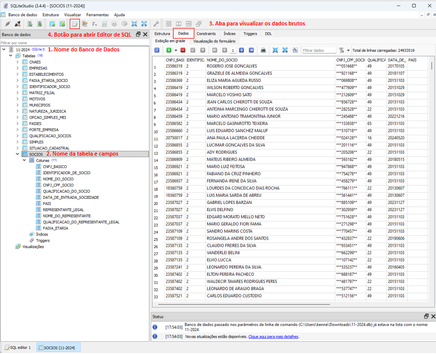

Com base na imagem abaixo, ao clicar no botão Abrir Editor de SQL [1], será exibido um campo denominado Consulta, onde você pode inserir comandos SQL para realizar suas pesquisas. Após digitar o comando, clique no botão Executar Consulta [2] para visualizar os dados filtrados em formato de grade. No exemplo apresentado, o comando SQL busca todos os campos da tabela SOCIOS em que o nome do sócio começa com ANA. Para a pesquisa solicitada, teve mais de 317 mil resultados.

```sql
SELECT * FROM SOCIOS WHERE SOCIOS.NOME_DO_SOCIO LIKE 'ANA%'
```

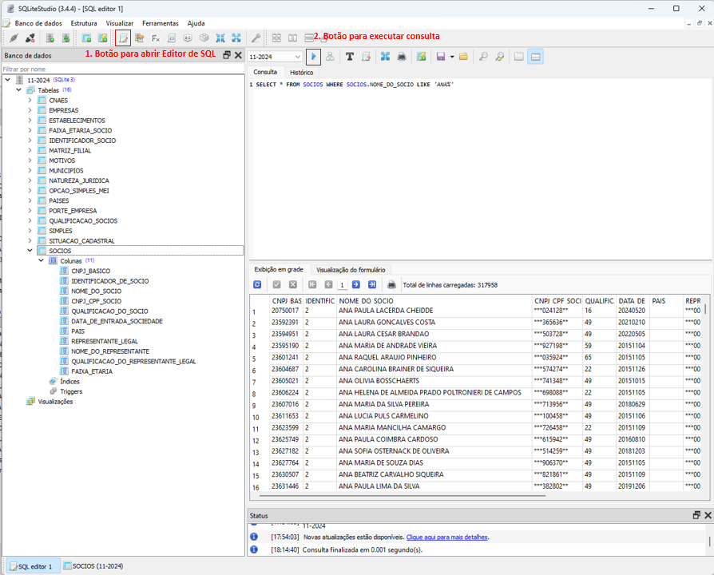

## Busca por nome parcial ou nome completo ##

Sócios cujo nome seja exatamente "ANA SILVA"
```sql
SELECT * FROM SOCIOS WHERE SOCIOS.NOME_DO_SOCIO = 'ANA SILVA';
```
Sócios cujo nome começa com "ANA"
```sql
SELECT * FROM SOCIOS WHERE SOCIOS.NOME_DO_SOCIO LIKE 'ANA%';
```
Sócios cujo nome termina com "SILVA"
```sql
SELECT * FROM SOCIOS WHERE SOCIOS.NOME_DO_SOCIO LIKE '%SILVA';
```
Sócios cujo nome contém "CARLOS" em qualquer posição
```sql
SELECT * FROM SOCIOS WHERE SOCIOS.NOME_DO_SOCIO LIKE '%CARLOS%';
```
Sócios cujo nome tem exatamente 5 letras e começa com "JO"
```sql
SELECT * FROM SOCIOS WHERE SOCIOS.NOME_DO_SOCIO LIKE 'JO___%';
```
Sócios cujo nome começa com "M" ou "N"
```sql
SELECT * FROM SOCIOS WHERE SOCIOS.NOME_DO_SOCIO LIKE 'M%' OR SOCIOS.NOME_DO_SOCIO LIKE 'N%';
```
Sócios cujo nome contém "ANA" mas não termina com "A"
```sql
SELECT * FROM SOCIOS WHERE SOCIOS.NOME_DO_SOCIO LIKE '%ANA%' AND SOCIOS.NOME_DO_SOCIO NOT LIKE '%A';
```
Sócios cujo nome começa com "MARIA" e tem pelo menos 6 caracteres
```sql
SELECT * FROM SOCIOS WHERE SOCIOS.NOME_DO_SOCIO LIKE 'MARIA%_' OR SOCIOS.NOME_DO_SOCIO LIKE 'MARIA%__';
```


## Busca de sócios pelo CNPJ da Empresa ##

Como exemplo de empresa, utilizaremos a Petrobrás, cujo CNPJ completo é 33.000.167/0125-41. Esse número é dividido em três partes principais:

`33.000.167`: CNPJ Básico - Identifica a raiz da empresa, comum a todas as filiais.<br>
`0125`: CNPJ Ordem - Representa a identificação de uma unidade específica (matriz ou filial).<br>
`41`: Dígitos Verificadores - Garantem a validade do número do CNPJ.<br>

Para buscar todos os sócios relacionados ao CNPJ básico da Petrobrás (matriz e filiais), utilizamos a seguinte consulta SQL:

```sql
SELECT * FROM SOCIOS WHERE CNPJ_BASICO = '33000167';
```
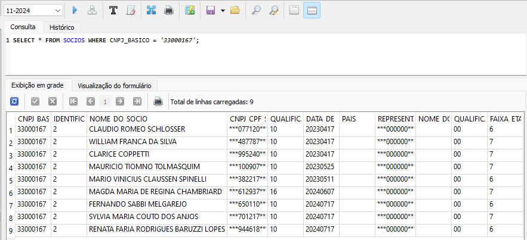

Para buscar somente Nome e Data de Entrada na Sociedade, utilizamos a seguinte consulta SQL:

```sql
SELECT

SOCIOS.NOME_DO_SOCIO,
SOCIOS.DATA_DE_ENTRADA_SOCIEDADE

FROM SOCIOS

WHERE CNPJ_BASICO = '33000167';
```
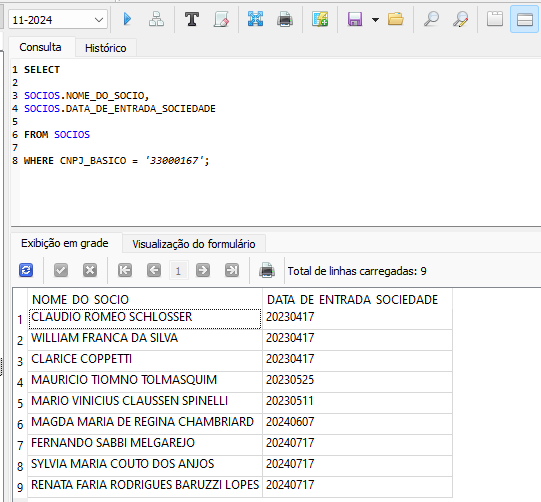

Você pode renomear cada coluna apresentada utilizando o `as` como no exemplo abaixo:

```sql
SELECT

SOCIOS.CNPJ_BASICO as 'CNPJ',
SOCIOS.IDENTIFICADOR_DE_SOCIO as 'TIPO',
SOCIOS.NOME_DO_SOCIO as 'NOME',
SOCIOS.CNPJ_CPF_SOCIO as 'CPF/CNPJ',
SOCIOS.QUALIFICACAO_DO_SOCIO as 'QUALIFICACAO',
SOCIOS.DATA_DE_ENTRADA_SOCIEDADE as 'ENTRADA SOCIEDADE',
SOCIOS.PAIS,
SOCIOS.REPRESENTANTE_LEGAL as 'CPF/CNPJ REPRESENTANTE',
SOCIOS.NOME_DO_REPRESENTANTE as 'NOME DO REPRESENTANTE',
SOCIOS.QUALIFICACAO_DO_REPRESENTANTE_LEGAL as 'QUALIF. DO REPRESENTANTE',
SOCIOS.FAIXA_ETARIA as 'FAIXA ETARIA'

FROM SOCIOS
WHERE CNPJ_BASICO = '33000167';
```
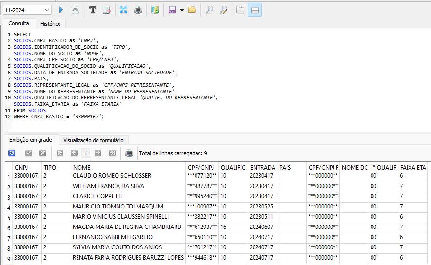

Você pode utilizar o `LEFT JOIN` para unir dados de outras tabelas que guardam códigos como Faixa Etária, Tipo de Sócio e Qualificações para ter os dados mais legíveis.

```sql
SELECT

SOCIOS.CNPJ_BASICO as 'CNPJ',
IDENTIFICADOR_SOCIO.IDENTIFICADOR as 'TIPO',
SOCIOS.NOME_DO_SOCIO as 'NOME',
SOCIOS.CNPJ_CPF_SOCIO as 'CPF/CNPJ',
QS1.DESCRICAO as 'QUALIFICACAO',
SOCIOS.DATA_DE_ENTRADA_SOCIEDADE as 'ENTRADA SOCIEDADE',
SOCIOS.PAIS,
SOCIOS.REPRESENTANTE_LEGAL as 'CPF/CNPJ REPRESENTANTE',
SOCIOS.NOME_DO_REPRESENTANTE as 'REPRESENTANTE',
QS2.DESCRICAO as 'QUALIF DO REPRESENTANTE',
FAIXA_ETARIA_SOCIO.FAIXA_ETARIA as 'IDADE'

FROM SOCIOS
LEFT JOIN IDENTIFICADOR_SOCIO ON SOCIOS.IDENTIFICADOR_DE_SOCIO = IDENTIFICADOR_SOCIO.COD
LEFT JOIN QUALIFICACAO_SOCIOS as 'QS1' ON SOCIOS.QUALIFICACAO_DO_SOCIO = QS1.COD
LEFT JOIN QUALIFICACAO_SOCIOS as 'QS2' ON SOCIOS.QUALIFICACAO_DO_REPRESENTANTE_LEGAL = QS2.COD
LEFT JOIN FAIXA_ETARIA_SOCIO ON SOCIOS.FAIXA_ETARIA = FAIXA_ETARIA_SOCIO.COD
WHERE CNPJ_BASICO = '33000167';
```
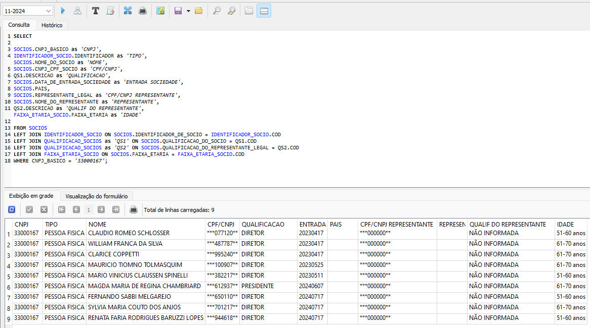

Com o `LEFT JOIN` você pode extrair dados correspondentes de outras tabelas, como no caso a seguir, o nome da empresa. No caso a seguir, a pesquisa demorou um tempo a mais com relação aos exemplos anteriores.

```sql
SELECT

SOCIOS.CNPJ_BASICO as 'CNPJ',
EMPRESAS.RAZAO_SOCIAL_NOME_EMPRESARIAL as 'EMPRESA',
IDENTIFICADOR_SOCIO.IDENTIFICADOR as 'TIPO',
SOCIOS.NOME_DO_SOCIO as 'NOME',
SOCIOS.CNPJ_CPF_SOCIO as 'CPF/CNPJ',
QS1.DESCRICAO as 'QUALIFICACAO',
SOCIOS.DATA_DE_ENTRADA_SOCIEDADE as 'ENTRADA SOCIEDADE',
SOCIOS.PAIS,
SOCIOS.REPRESENTANTE_LEGAL as 'CPF/CNPJ REPRESENTANTE',
SOCIOS.NOME_DO_REPRESENTANTE as 'REPRESENTANTE',
QS2.DESCRICAO as 'QUALIF DO REPRESENTANTE',
FAIXA_ETARIA_SOCIO.FAIXA_ETARIA as 'IDADE'

FROM SOCIOS
LEFT JOIN EMPRESAS ON SOCIOS.CNPJ_BASICO = EMPRESAS.CNPJ_BASICO
LEFT JOIN IDENTIFICADOR_SOCIO ON SOCIOS.IDENTIFICADOR_DE_SOCIO = IDENTIFICADOR_SOCIO.COD
LEFT JOIN QUALIFICACAO_SOCIOS as 'QS1' ON SOCIOS.QUALIFICACAO_DO_SOCIO = QS1.COD
LEFT JOIN QUALIFICACAO_SOCIOS as 'QS2' ON SOCIOS.QUALIFICACAO_DO_REPRESENTANTE_LEGAL = QS2.COD
LEFT JOIN FAIXA_ETARIA_SOCIO ON SOCIOS.FAIXA_ETARIA = FAIXA_ETARIA_SOCIO.COD
WHERE SOCIOS.CNPJ_BASICO = '33000167';
```
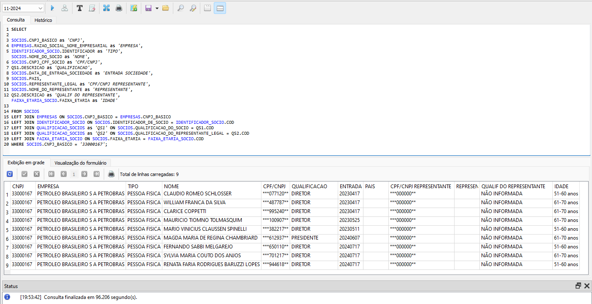

Para exportar os dados, basta clicar no botão `Exportar Resultados`...

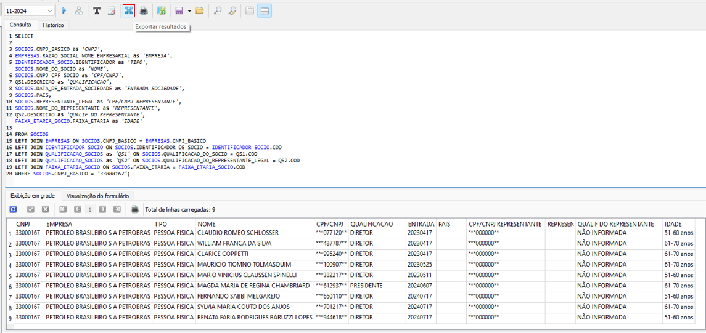

Clicar em `Next` como na tela esquerda e depois marcar 'Nomes das Colunas na primeira linha' como na tela da direita...

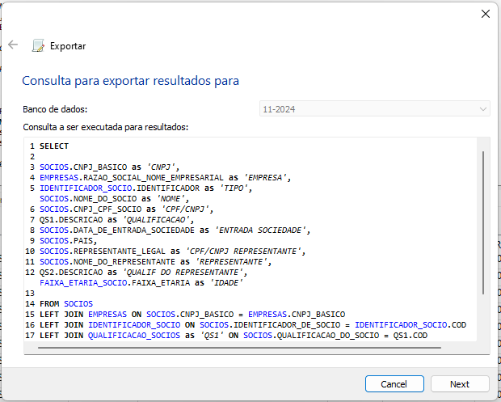
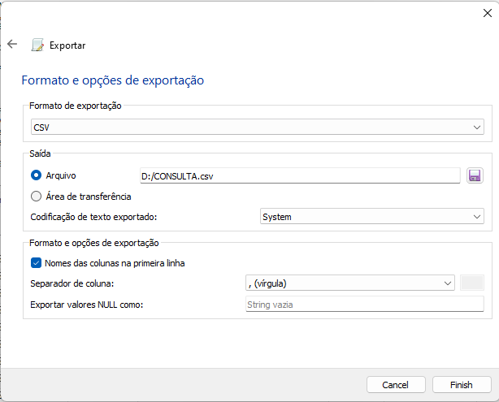

Agora pode abrir seu documento em qualquer leitor de planilhas (Excel, LibreOffice, WPS, Google Drive).

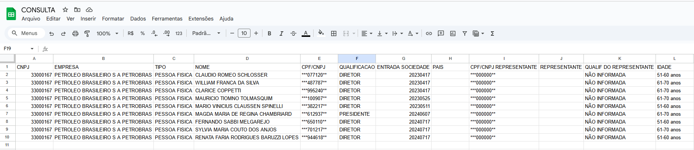


## Busca de sócios por mais de um campo de pesquisa ##

Você pode pesquisar sócios por Nome e/ou outros dados. Como o exemplo a seguir, busca todos os sócios com nomes que começam por `ANA` e que tenham `1234` em qualquer parte do CPF.

```sql
SELECT * FROM SOCIOS
WHERE

SOCIOS.NOME_DO_SOCIO LIKE 'ANA%' AND
SOCIOS.CNPJ_CPF_SOCIO LIKE '%1234%'
```

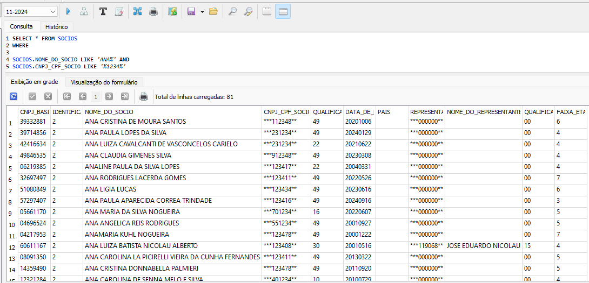

Ou você pode pesquisar todos os sócios com nomes que começam por `ANA` e que tenham `1234` em qualquer parte do CPF ou sócios que começam por `BRUNO` e tenham `5678` em qualquer parte do CPF.

```sql
SELECT * FROM SOCIOS
WHERE

SOCIOS.NOME_DO_SOCIO LIKE 'ANA%' AND
SOCIOS.CNPJ_CPF_SOCIO LIKE '%1234%' OR
SOCIOS.NOME_DO_SOCIO LIKE 'BRUNO%' AND
SOCIOS.CNPJ_CPF_SOCIO LIKE '%5678%'
```

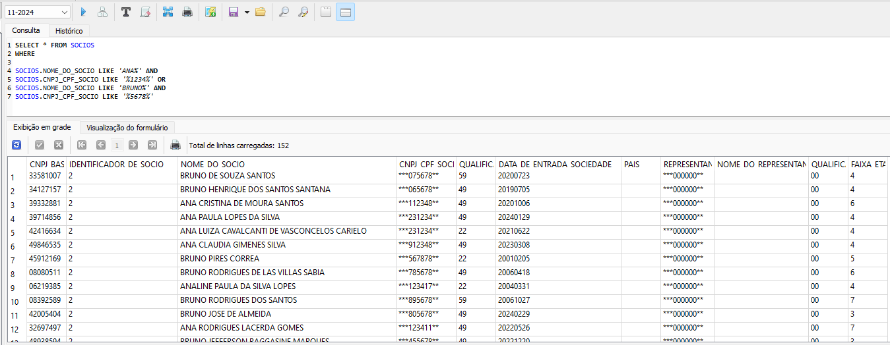