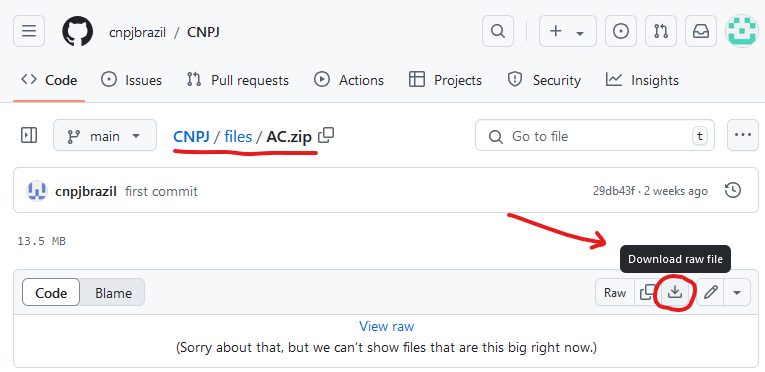
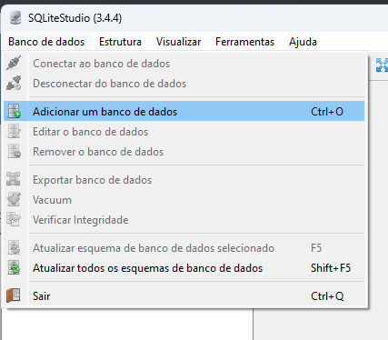
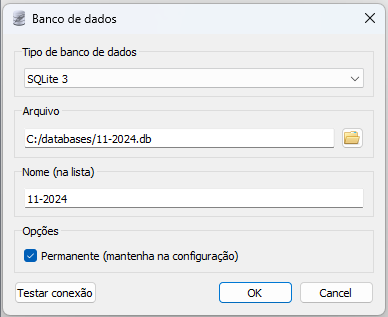
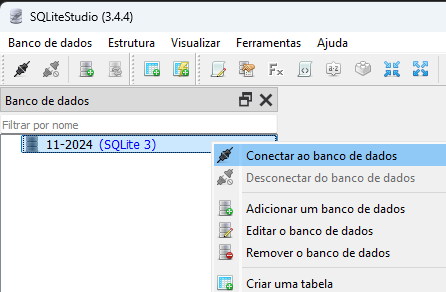
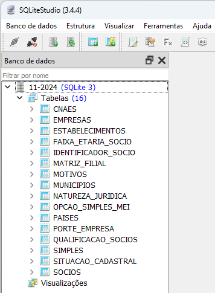
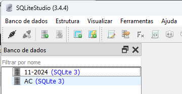
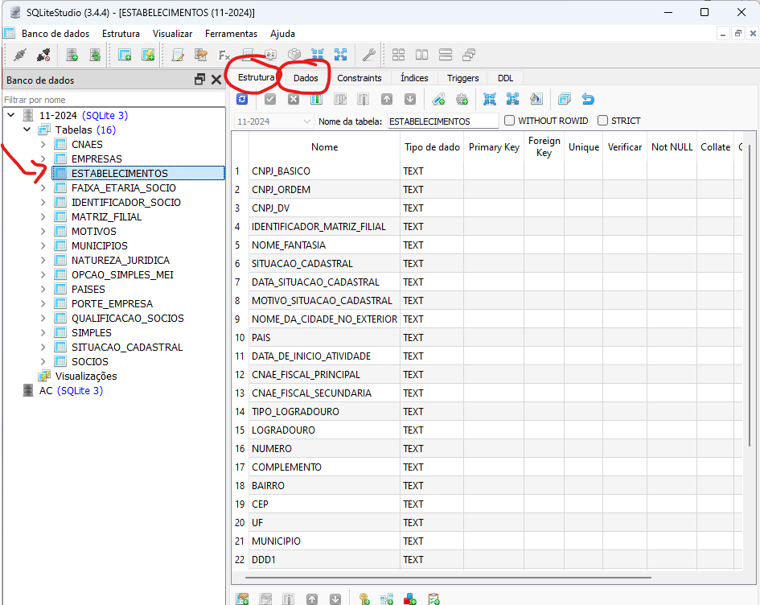
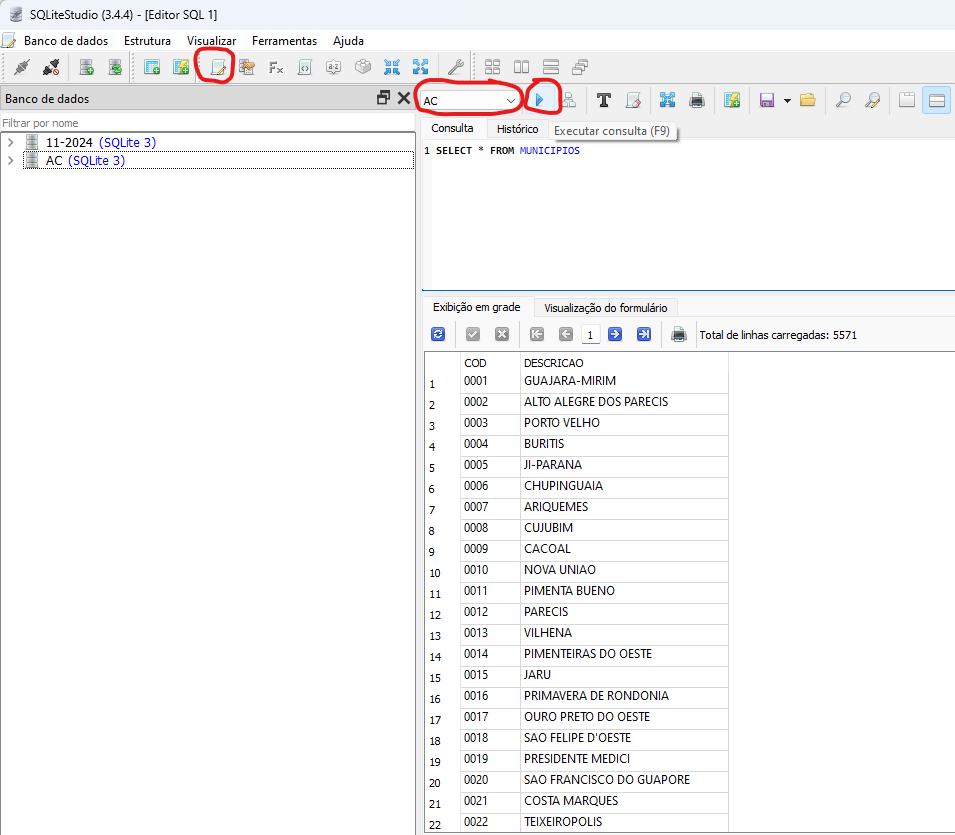
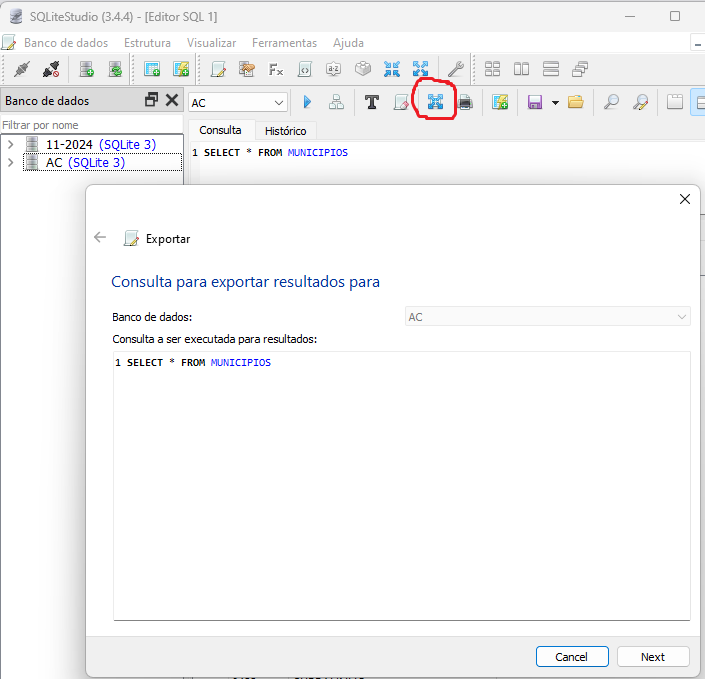
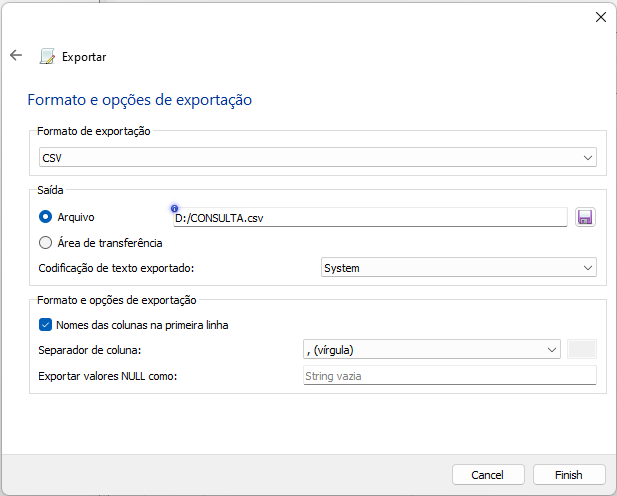

[VOLTAR AO INÍCIO](main.md)

# Como utilizar o SQLiteStudio e o banco de dados #

Neste tutorial, utilizaremos o SQLiteStudio como software para abrir e consultar bancos de dados no formato SQLite3. O SQLiteStudio é uma ferramenta prática e intuitiva, que pode ser baixada diretamente pelo link: https://sqlitestudio.pl/. Com ela, é possível abrir múltiplos bancos de dados, realizar consultas e exportar os dados em formato CSV, compatível com softwares como Microsoft Excel, Power BI e Google Sheets, entre outros.

O banco de dados utilizado neste tutorial contém informações completas de empresas em todo o Brasil. No entanto, para simplificar, usaremos um banco de dados menor, com informações apenas do estado do Acre. Para fazer o download, [clique aqui](../files/AC.zip) e em seguida selecione o botão "Download Raw File". Após o download, descompacte o arquivo para utilizá-lo no tutorial.

Após instalar o SQLiteStudio, abra o software e siga estas etapas para abrir um banco de dados:

1 - No menu superior, clique em "Banco de Dados". 
2 - Em seguida, selecione a opção "Adicionar um Banco de Dados". 

3 - Selecione o formato "SQLite3" como tipo de banco de dados. 
4 - Em "Arquivo", clique no botão com ícone de pasta e na janela que será exibida, navegue até o arquivo do banco de dados desejado, selecione-o e clique em "OK" para carregá-lo. 
5 - Em "Nome", mantenha ou escolha um nome adequado para seu banco de dados, como Brasil-NOV-24, Acre-NOV-24, AC, ou outra descrição para o seu banco de dados. 
6 - Deixe marcado a opção "Permanente" para que o banco de dados esteja sempre na lista ao abrir o SQLiteStudio. 
7 - Aperte "OK". 

Após adicionar o banco de dados, ele estará disponível na interface do software, permitindo consultas e outras operações. Para abri-lo, basta clicar com o botão direito sobre o banco de dados desejado e selecionar a opção "Conectar ao Banco de Dados". Uma vez conectado, será possível explorar tabelas, executar consultas e manipular os dados conforme necessário.

Ao conectar, você poderá ver todas as tabelas do banco e estrutura das tabelas.

Se tiver outros bancos de dados adicionados, vai constar tudo como uma lista.

Ao clicar duas vezes em qualquer tabela, como por exemplo "ESTABELECIMENTOS", os detalhes serão exibidos no painel à direita. Nesse painel, é possível visualizar todos os campos e a estrutura da tabela. Caso deseje visualizar os dados armazenados, basta acessar a aba "Dados".

Para realizar uma consulta SQL, clique em "Abrir editor de SQL". No editor, utilize o menu suspenso para selecionar o banco de dados desejado (se o banco de dados não estiver listado, será necessário conectá-lo primeiro). Em seguida, digite o comando SQL no campo de consulta e clique em "Executar consulta". Logo abaixo, será exibida a quantidade de linhas retornadas pela consulta (por exemplo, 5571 linhas) e o dados exibidos em grade.

Para exportar os resultados da consulta que deseja, clique em "Exportar resultados" e abrirá uma janela. Clique em "Next".

Ao exportar os dados, selecione o formato "CSV", escolha o local onde o arquivo será salvo e certifique-se de marcar a opção "Nomes das colunas na primeira linha". Por fim, clique no botão "Finish" para concluir a exportação.

Agora, você poderá exportar qualquer consulta no formato CSV, incluindo informações como situação cadastral, quadro societário, endereços e telefones de empresas e estabelecimentos. Além disso, é possível filtrar os dados conforme suas necessidades antes de realizar a exportação.

[VOLTAR AO INÍCIO](main.md)
