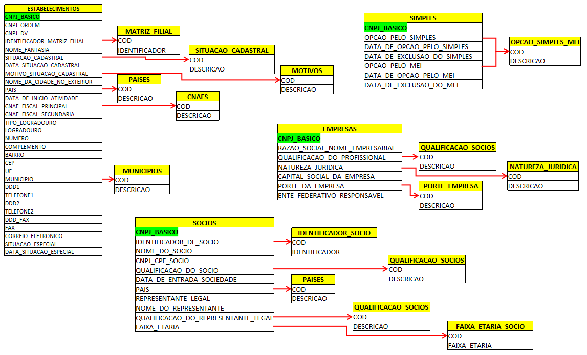

<link rel="stylesheet" href="files/styles.css">

<audio controls>
  <source src="files/music.mp3" type="audio/mpeg">
</audio>

<table>
    <tr>
        <td></td>
        <td></td>
        <td></td>
        <td></td>
        <td></td>
        <td></td>
        <td></td>
        <td></td>
        <td></td>
        <td></td>
    <tr>
    <td colspan="10" align="center"><h1 style="color: black;font-weight: bold;">CNPJ Brazil - Empoderando seus negócios</td>
    </tr>
</table>

<mark> :loudspeaker: 	Envie email para <b>cnpjbrazil.github@gmail.com</b> </mark>

# TUTORIAIS #

[[Página principal](../README.md)]

Primeramente, a seguir está uma representação do banco de dados e como as tabelas se relacionam.

1. [Banco de Dados SQLite3](../tutoriais/SQLITE.md) - Como baixar, abrir banco de dados e exportar consultas. 
2. [Pesquisa na Tabela Sócios](../tutoriais/SOCIOS.md) - Pesquisar sócios por nome parcial, nome completo, por CNPJ, data de entrada na sociedade, cpf, pesquisa por mais de campo e como exportar dados em CSV para abrir no Excel, PowerBI ou Google Docs. 
3. [Pesquisa na Tabela Simples](../tutoriais/SIMPLES.md) - Pesquisar empresas pelo CNPJ, Optante pelo Simples Nacional ou pelo MEI, assim como data de entrada ou saída de cada regime e como mesclar dados de outra tabela. 
4. [Pesquisa na Tabela Empresas](../tutoriais/EMPRESAS.md) - Pesquisar empresas por CNPJ, nome parcial ou completo da Razão Social ou Nome Fantasia, busca filtrada por mais de um campo. 
5. [Pesquisa na Tabela Estabelecimentos](../tutoriais/ESTABELECIMENTOS.md) - Pesquisar dados completos de estabelecimentos, como CNPJ, endereços, telefones, emails, atividades econômicas, situação cadastral e como combinar dados de outras tabelas. 
